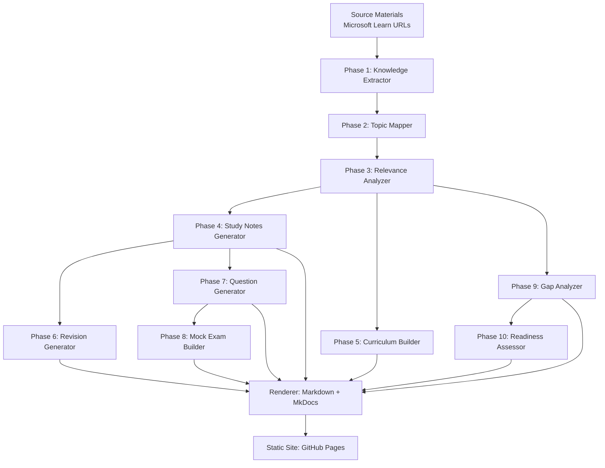

# Design Document: GH-600 Exam Prep Generator

## Overview

This design describes the architecture and implementation of a comprehensive exam preparation package generator for the GitHub Certified Agentic AI Developer (GH-600) certification. The system is a Python-based pipeline that ingests source materials from Microsoft Learn and GitHub documentation, processes them through ten distinct phases (extraction, mapping, scoring, notes, curriculum, revision, questions, mock exam, gap analysis, readiness assessment), and produces a complete static study website deployed to GitHub Pages via MkDocs Material.

The system is designed as a sequential pipeline where each phase produces structured intermediate artifacts (JSON/YAML) consumed by downstream phases. The final rendering phase transforms all artifacts into Markdown documents organized for MkDocs, which then builds the deployable static site.

### Key Design Decisions

1. **Python as implementation language**: Rich ecosystem for web scraping (httpx, BeautifulSoup), NLP, templating (Jinja2), and excellent MkDocs integration.
2. **MkDocs Material as static site generator**: Native GitHub Pages support, built-in search (lunr.js), Mermaid diagram rendering, responsive design, sidebar navigation, and breadcrumbs — all without external CDN dependencies.
3. **JSON intermediate artifacts**: Each pipeline phase outputs structured JSON enabling validation, debugging, and independent re-execution of phases.
4. **Pipeline architecture over monolith**: Each phase is independently testable, can be re-run without re-executing the full pipeline, and produces auditable intermediate output.

## Architecture

### High-Level Architecture



### Pipeline Execution Model

The system uses a **directed acyclic graph (DAG)** execution model where each phase:
1. Reads its required input artifacts from disk (JSON files in `artifacts/`)
2. Performs its processing logic
3. Writes its output artifact(s) to disk
4. Reports success/failure status with metrics

A top-level orchestrator (`pipeline.py`) manages phase execution order, handles failures gracefully (logging errors, continuing where possible), and produces a final pipeline execution report.

### Directory Structure

```
gh-600-preparation/
├── src/
│   ├── __init__.py
│   ├── pipeline.py              # Orchestrator
│   ├── config.py                # Configuration & constants
│   ├── models/                  # Pydantic data models
│   │   ├── __init__.py
│   │   ├── knowledge.py         # Extracted knowledge models
│   │   ├── topic_map.py         # Topic hierarchy models
│   │   ├── scoring.py           # Priority scoring models
│   │   ├── study_notes.py       # Study notes models
│   │   ├── curriculum.py        # Curriculum models
│   │   ├── revision.py          # Revision resource models
│   │   ├── questions.py         # Question models
│   │   ├── mock_exam.py         # Mock exam models
│   │   ├── gap_analysis.py      # Gap analysis models
│   │   └── readiness.py         # Readiness assessment models
│   ├── phases/                  # Pipeline phases
│   │   ├── __init__.py
│   │   ├── phase01_extractor.py
│   │   ├── phase02_mapper.py
│   │   ├── phase03_analyzer.py
│   │   ├── phase04_notes.py
│   │   ├── phase05_curriculum.py
│   │   ├── phase06_revision.py
│   │   ├── phase07_questions.py
│   │   ├── phase08_mock_exam.py
│   │   ├── phase09_gap.py
│   │   └── phase10_readiness.py
│   ├── rendering/               # Markdown rendering
│   │   ├── __init__.py
│   │   ├── renderer.py          # Main rendering orchestrator
│   │   └── templates/           # Jinja2 templates
│   └── utils/                   # Shared utilities
│       ├── __init__.py
│       ├── scraper.py           # HTTP client + HTML parsing
│       ├── dedup.py             # URL deduplication
│       └── logging.py           # Structured logging
├── artifacts/                   # Pipeline intermediate outputs (JSON)
├── docs/                        # MkDocs source (generated Markdown)
├── mkdocs.yml                   # MkDocs configuration
├── pyproject.toml               # Project & dependency config
├── tests/                       # Test suite
│   ├── unit/
│   ├── property/
│   └── integration/
└── .github/
    └── workflows/
        └── deploy.yml           # GitHub Actions CI/CD
```

## Components and Interfaces

### Phase 1: Knowledge Extractor

**Responsibility**: Ingest source materials, follow links up to 2 levels deep (max 50 per level), extract all knowledge points, deduplicate content reached via multiple paths.

**Interface**:
```python
class KnowledgeExtractor:
    def __init__(self, config: ExtractorConfig) -> None: ...
    async def extract(self, source_urls: list[str]) -> ExtractionResult: ...
    async def _fetch_and_parse(self, url: str, depth: int) -> ParsedDocument: ...
    def _extract_knowledge_points(self, doc: ParsedDocument) -> list[KnowledgePoint]: ...
    def _reconstruct_prerequisites(self, points: list[KnowledgePoint]) -> list[KnowledgePoint]: ...
```

**Key Behaviors**:
- Uses `httpx.AsyncClient` with rate limiting (max 5 concurrent requests, 1s delay between requests to same domain)
- Tracks visited URLs via normalized URL set for deduplication (Requirement 1.6)
- Logs inaccessible resources with URL, error, and referrer (Requirement 1.3)
- Follows links only within `learn.microsoft.com` and `docs.github.com` domains
- Depth 0 = source documents, Depth 1 = first-level links, Depth 2 = second-level links

### Phase 2: Topic Mapper

**Responsibility**: Organize extracted knowledge into a hierarchical structure aligned with the 6 GH-600 exam domains, identify prerequisites, produce learning order.

**Interface**:
```python
class TopicMapper:
    def __init__(self, exam_domains: list[ExamDomain]) -> None: ...
    def map_topics(self, knowledge: ExtractionResult) -> TopicHierarchy: ...
    def _assign_to_domains(self, points: list[KnowledgePoint]) -> dict[str, list[Topic]]: ...
    def _identify_prerequisites(self, topics: list[Topic]) -> list[Dependency]: ...
    def _compute_learning_order(self, topics: list[Topic], deps: list[Dependency]) -> list[str]: ...
    def _detect_cycles(self, deps: list[Dependency]) -> list[list[str]]: ...
    def _identify_cross_references(self, topics: list[Topic]) -> list[CrossReference]: ...
```

**Key Behaviors**:
- Topological sort for learning order (Kahn's algorithm)
- Cycle detection groups mutually dependent topics into single learning units (Requirement 2.6)
- Cross-references identified when topics share tool, API, pattern, or workflow references (Requirement 2.5)

### Phase 3: Relevance Analyzer

**Responsibility**: Assign Priority_Scores (1-10) to all topics based on domain weights and cross-domain presence.

**Interface**:
```python
class RelevanceAnalyzer:
    def __init__(self, domain_weights: dict[str, tuple[float, float]]) -> None: ...
    def analyze(self, hierarchy: TopicHierarchy) -> ScoredTopicList: ...
    def _compute_base_score(self, topic: Topic) -> int: ...
    def _apply_cross_domain_bonus(self, topic: Topic, base: int) -> int: ...
    def _sort_topics(self, topics: list[ScoredTopic]) -> list[ScoredTopic]: ...
```

**Scoring Algorithm**:
1. Map domain weight ranges to base score ranges: 20-25% → base 8-9, 15-20% → base 6-8, 10-15% → base 5-7
2. Within each range, topics closer to domain core concepts score higher
3. Add +1 per additional domain appearance (capped at 10)
4. Sort: descending Priority_Score → descending domain count → alphabetical name
5. Flag topics with score ≥ 8 as "high-priority"

### Phase 4: Study Notes Generator

**Responsibility**: Produce comprehensive study notes for every topic with required sections, code examples, cross-references, and expanded content for high-priority topics.

**Interface**:
```python
class StudyNotesGenerator:
    def __init__(self, config: NotesConfig) -> None: ...
    def generate(self, hierarchy: TopicHierarchy, scores: ScoredTopicList) -> StudyNotesCollection: ...
    def _generate_topic_notes(self, topic: Topic, score: ScoredTopic) -> TopicNotes: ...
    def _build_cross_references(self, topic: Topic, all_topics: list[Topic]) -> list[RelatedTopic]: ...
    def _supplement_sparse_topics(self, notes: TopicNotes) -> TopicNotes: ...
```

**Key Behaviors**:
- High-priority topics (score ≥ 8): minimum 400-word explanation, 2+ examples (Requirement 4.7)
- Sparse topics (< 3 knowledge points): supplements with inferred content marked with `> [!NOTE] Supplemented content` (Requirement 4.6)
- Cross-references use topic heading anchors (Requirement 4.5)
- Code blocks include language identifiers and inline comments (Requirement 4.4)

### Phase 5: Curriculum Builder

**Responsibility**: Structure study material into sequential modules with objectives, prerequisites, and time estimates.

**Interface**:
```python
class CurriculumBuilder:
    def __init__(self) -> None: ...
    def build(self, hierarchy: TopicHierarchy, scores: ScoredTopicList) -> Curriculum: ...
    def _create_modules(self, topics: list[Topic]) -> list[Module]: ...
    def _estimate_time(self, module: Module, avg_time: float) -> int: ...
    def _validate_bloom_verbs(self, objectives: list[str]) -> bool: ...
```

**Key Behaviors**:
- Module time estimates: 15-180 minutes range (Requirement 5.4)
- High-priority modules get 1.5× average time of non-high-priority modules (Requirement 5.6)
- 2-7 learning objectives per module using Bloom's Taxonomy verbs (Requirement 5.2)
- Prerequisites reference module identifiers (Requirement 5.3)

### Phase 6: Revision Generator

**Responsibility**: Produce condensed revision resources — executive summary, cheat sheets, flashcards (100+ minimum), and mnemonics.

**Interface**:
```python
class RevisionGenerator:
    def __init__(self) -> None: ...
    def generate(self, notes: StudyNotesCollection, scores: ScoredTopicList) -> RevisionPackage: ...
    def _generate_executive_summary(self, notes: StudyNotesCollection) -> str: ...
    def _generate_cheat_sheets(self, notes: StudyNotesCollection) -> list[CheatSheet]: ...
    def _generate_flashcards(self, notes: StudyNotesCollection, scores: ScoredTopicList) -> list[Flashcard]: ...
    def _generate_mnemonics(self, notes: StudyNotesCollection) -> list[Mnemonic]: ...
```

**Key Behaviors**:
- Executive summary ≤ 2000 words covering all 6 domains (Requirement 6.1)
- At least 1 table per domain in cheat sheets (Requirement 6.2)
- Minimum 100 flashcards distributed across all 6 domains (Requirement 6.3)
- Flashcards tagged with domain name and Priority_Score (Requirement 6.5)
- Flashcard format: `Q:` / `A:` with blank line separator (Requirement 6.6)
- Mnemonics for topics with 3+ sequential steps/components (Requirement 6.4)

### Phase 7: Question Generator

**Responsibility**: Create practice questions at easy/intermediate/advanced levels, minimum 20 per level, with explanations and domain-proportional distribution.

**Interface**:
```python
class QuestionGenerator:
    def __init__(self, domain_weights: dict[str, tuple[float, float]]) -> None: ...
    def generate(self, notes: StudyNotesCollection, scores: ScoredTopicList) -> QuestionBank: ...
    def _generate_easy(self, topics: list[Topic]) -> list[Question]: ...
    def _generate_intermediate(self, topics: list[Topic]) -> list[Question]: ...
    def _generate_advanced(self, topics: list[Topic]) -> list[Question]: ...
    def _distribute_by_domain(self, count: int) -> dict[str, int]: ...
```

**Key Behaviors**:
- Three formats: multiple choice (4 options, 1 correct), multiple select (4-6 options, 2+ correct), scenario-based (Requirement 7.6)
- Advanced: ≥50% scenario-based requiring 2+ topics (Requirement 7.5)
- Each question includes correct answer, reasoning, relevant concept, and study notes reference (Requirement 7.3)
- Explains why each incorrect answer is wrong for multi-plausible questions (Requirement 7.7)

### Phase 8: Mock Exam Builder

**Responsibility**: Assemble realistic 50+ question mock exam with domain-weighted distribution, answer key, solutions, and grading rubric.

**Interface**:
```python
class MockExamBuilder:
    def __init__(self, domain_weights: dict[str, tuple[float, float]]) -> None: ...
    def build(self, question_bank: QuestionBank, scores: ScoredTopicList) -> MockExam: ...
    def _select_questions(self, bank: QuestionBank) -> list[Question]: ...
    def _build_grading_rubric(self, questions: list[Question]) -> GradingRubric: ...
    def _calculate_time_limit(self) -> int: ...
```

**Key Behaviors**:
- 50+ questions, domain distribution within ±5pp of target weights (Requirement 8.2)
- Each format (MC, MS, scenario) ≥ 15% of total (Requirement 8.6)
- Grading: 1 point per single-answer, full credit only for all-correct on multi-select (Requirement 8.5)
- Pass threshold: 700/1000 (Requirement 8.5)
- High-priority question solutions include cross-reference links to study notes (Requirement 8.7)

### Phase 9: Gap Analyzer

**Responsibility**: Compare generated material against official exam objectives, identify coverage gaps, and recommend additional resources.

**Interface**:
```python
class GapAnalyzer:
    def __init__(self, official_objectives: list[ExamObjective]) -> None: ...
    def analyze(self, notes: StudyNotesCollection, scores: ScoredTopicList, 
                extraction_log: ExtractionLog) -> GapReport: ...
    def _assess_coverage(self, objective: ExamObjective, notes: StudyNotesCollection) -> CoverageStatus: ...
    def _identify_critical_gaps(self, gaps: list[Gap], scores: ScoredTopicList) -> list[CriticalGap]: ...
    def _recommend_resources(self, gap: Gap) -> list[Recommendation]: ...
```

**Key Behaviors**:
- Coverage statuses: "fully covered" (≥3 knowledge points), "weakly covered" (1-2 points), "not covered" (0 points or inaccessible source) (Requirements 9.1-9.3)
- Critical gaps: high-priority topics (score ≥ 8) placed in dedicated section at top of report (Requirement 9.5)
- At least 2 resource recommendations per gap (Requirement 9.4)

### Phase 10: Readiness Assessor

**Responsibility**: Calculate readiness score, identify high-risk topics, produce last-minute study plan.

**Interface**:
```python
class ReadinessAssessor:
    def __init__(self) -> None: ...
    def assess(self, gap_report: GapReport, notes: StudyNotesCollection, 
               scores: ScoredTopicList) -> ReadinessAssessment: ...
    def _calculate_score(self, gap_report: GapReport, notes: StudyNotesCollection) -> int: ...
    def _identify_high_risk(self, gap_report: GapReport, scores: ScoredTopicList) -> list[HighRiskTopic]: ...
    def _build_24h_plan(self, high_risk: list[HighRiskTopic]) -> list[TimeBlock]: ...
    def _build_remediation_plan(self, score: int, high_risk: list[HighRiskTopic]) -> RemediationPlan | None: ...
```

**Key Behaviors**:
- Readiness_Score = average of: % objectives fully covered, % topics with notes+questions, inverse % of gap topics (Requirement 10.1)
- Max 10 high-risk topics, sorted by Priority_Score descending (Requirement 10.2)
- 24h plan: 60-minute blocks with topic + resource type (Requirement 10.4)
- Score < 70: recommend deferral + remediation plan (Requirement 10.5)

### Rendering Layer

**Responsibility**: Transform all phase artifacts into MkDocs-compatible Markdown documents using Jinja2 templates.

**Interface**:
```python
class SiteRenderer:
    def __init__(self, template_dir: Path, output_dir: Path) -> None: ...
    def render_all(self, artifacts: PipelineArtifacts) -> None: ...
    def _render_landing_page(self, artifacts: PipelineArtifacts) -> None: ...
    def _render_study_notes(self, notes: StudyNotesCollection) -> None: ...
    def _render_curriculum(self, curriculum: Curriculum) -> None: ...
    def _render_revision(self, revision: RevisionPackage) -> None: ...
    def _render_questions(self, bank: QuestionBank) -> None: ...
    def _render_mock_exam(self, exam: MockExam) -> None: ...
    def _render_gap_report(self, report: GapReport) -> None: ...
    def _render_readiness(self, assessment: ReadinessAssessment) -> None: ...
    def _generate_mkdocs_nav(self, artifacts: PipelineArtifacts) -> dict: ...
```

**Key Behaviors**:
- Generates `mkdocs.yml` nav structure dynamically from artifacts
- All Markdown uses GFM with proper heading hierarchy (H1-H4)
- Cross-reference links resolve to generated page paths
- Mermaid diagrams embedded as fenced code blocks (rendered by MkDocs Material plugin)
- Code blocks include language identifiers
- Callout blocks use MkDocs Material admonition syntax (`!!! tip`, `!!! warning`, etc.)

### MkDocs Configuration

**Technology Choice Rationale**: MkDocs Material provides all requirements out-of-the-box:
- Client-side search via lunr.js (Requirement 13.4)
- Sidebar navigation with 2+ levels (Requirement 13.2)
- Mermaid diagram rendering via built-in plugin (Requirement 13.5)
- Responsive design from 320px to 2560px (Requirement 13.6)
- Breadcrumb navigation (Requirement 13.7)
- Previous/next navigation (Requirement 13.7)
- Syntax highlighting for code blocks (Requirement 13.5)
- Admonition blocks for tips/warnings (Requirement 13.5)
- All assets bundled locally — no external CDN needed (Requirement 14.7)

```yaml
# mkdocs.yml (conceptual structure)
site_name: GH-600 Exam Prep
site_url: https://<username>.github.io/gh-600-preparation/
theme:
  name: material
  features:
    - navigation.sidebar
    - navigation.tabs
    - navigation.path       # breadcrumbs
    - navigation.indexes
    - search.suggest
    - search.highlight
    - content.code.copy
  palette:
    - scheme: default
plugins:
  - search
  - mermaid2
markdown_extensions:
  - admonition
  - pymdownx.details
  - pymdownx.superfences:
      custom_fences:
        - name: mermaid
          class: mermaid
          format: !!python/name:pymdownx.superfences.fence_code_format
  - pymdownx.highlight
  - pymdownx.inlinehilite
  - tables
  - toc:
      permalink: true
extra:
  social: []
```

### GitHub Actions Deployment

```yaml
# .github/workflows/deploy.yml
name: Deploy Study Site
on:
  push:
    branches: [main]
jobs:
  deploy:
    runs-on: ubuntu-latest
    permissions:
      pages: write
      id-token: write
    steps:
      - uses: actions/checkout@v4
      - uses: actions/setup-python@v5
        with:
          python-version: '3.12'
      - run: pip install -r requirements.txt
      - run: mkdocs build --strict
      - uses: actions/upload-pages-artifact@v3
        with:
          path: site/
      - uses: actions/deploy-pages@v4
```

## Data Models

All data models use Pydantic v2 for validation, serialization, and JSON schema generation.

### Core Domain Models

```python
from pydantic import BaseModel, Field
from enum import Enum
from typing import Optional

# === Exam Structure ===

class ExamDomain(BaseModel):
    """One of the 6 official GH-600 exam domains."""
    id: str                          # e.g., "domain-1"
    name: str                        # e.g., "Prepare agent architecture and SDLC processes"
    weight_min: float                # e.g., 0.15
    weight_max: float                # e.g., 0.20
    sub_topics: list[str]            # Official sub-topic bullet points

class ExamObjective(BaseModel):
    """A single testable objective from the study guide."""
    id: str
    domain_id: str
    description: str
    sub_bullets: list[str]

# === Knowledge Extraction ===

class KnowledgePoint(BaseModel):
    """A single extracted piece of knowledge."""
    id: str
    content: str
    category: str                    # concept | definition | fact | theory | procedure | framework
    source_url: str
    source_title: str
    depth: int                       # 0, 1, or 2
    is_prerequisite: bool = False    # True if reconstructed (Req 1.5)

class ParsedDocument(BaseModel):
    """A fetched and parsed source document."""
    url: str
    title: str
    content_text: str
    links: list[str]
    knowledge_points: list[KnowledgePoint]
    fetch_error: Optional[str] = None

class ExtractionResult(BaseModel):
    """Complete output of Phase 1."""
    documents: list[ParsedDocument]
    all_knowledge_points: list[KnowledgePoint]
    error_log: list[dict]            # {url, error, referrer}
    visited_urls: set[str]
    stats: dict                      # counts by depth, domain, category
```

### Topic Hierarchy Models

```python
class Topic(BaseModel):
    """A single topic in the hierarchy."""
    id: str
    name: str
    domain_id: str
    sub_domain: Optional[str] = None
    knowledge_point_ids: list[str]
    description: str

class Dependency(BaseModel):
    """A prerequisite relationship between topics."""
    source_topic_id: str
    target_topic_id: str
    relationship: str                # e.g., "requires understanding of"

class CrossReference(BaseModel):
    """A cross-reference between related topics."""
    topic_id_a: str
    topic_id_b: str
    shared_concept: str              # tool, API, pattern, or workflow name

class TopicHierarchy(BaseModel):
    """Complete output of Phase 2."""
    domains: dict[str, list[Topic]]
    dependencies: list[Dependency]
    cross_references: list[CrossReference]
    learning_order: list[str]        # Ordered topic IDs
    learning_units: list[list[str]]  # Cyclic groups merged into units
```

### Scoring and Study Content Models

```python
class ScoredTopic(BaseModel):
    """A topic with its priority score."""
    topic_id: str
    topic_name: str
    domain_ids: list[str]
    priority_score: int = Field(ge=1, le=10)
    is_high_priority: bool           # True if score >= 8
    domain_count: int

class ScoredTopicList(BaseModel):
    """Complete output of Phase 3."""
    topics: list[ScoredTopic]        # Sorted by score desc, domain_count desc, name asc

class TopicNotes(BaseModel):
    """Study notes for a single topic."""
    topic_id: str
    topic_name: str
    domain_id: str
    priority_score: int
    overview: str                    # Min 3 sentences
    explanation: str                 # Min 200 words (400 for high-priority)
    key_facts: list[str]             # Min 3 items
    common_mistakes: list[str]       # Min 2 items
    examples: list[str]              # Min 1 (min 2 for high-priority)
    exam_tips: list[str]             # Min 1
    code_blocks: list[dict]          # {language, code, comments}
    step_by_step: Optional[list[dict]] = None  # {step, rationale}
    related_topics: list[dict]       # {topic_id, domain_name, relationship}
    is_supplemented: bool = False    # True if content was inferred

class StudyNotesCollection(BaseModel):
    """Complete output of Phase 4."""
    notes: list[TopicNotes]
    cross_domain_themes: list[dict]  # {theme, domains, manifestations}
```

### Curriculum Models

```python
class Module(BaseModel):
    """A single curriculum module."""
    id: str                          # e.g., "M01"
    title: str
    topic_ids: list[str]
    objectives: list[str]            # 2-7 items, Bloom's verbs
    prerequisites: list[str]         # Module IDs or ["none"]
    time_estimate_minutes: int = Field(ge=15, le=180)
    contains_high_priority: bool

class Curriculum(BaseModel):
    """Complete output of Phase 5."""
    modules: list[Module]
    total_time_minutes: int
    learning_path: list[str]         # Ordered module IDs
```

### Revision Resource Models

```python
class Flashcard(BaseModel):
    """A single flashcard."""
    id: str
    question: str                    # Prefixed with "Q: "
    answer: str                      # Prefixed with "A: "
    domain_name: str
    topic_id: str
    priority_score: int

class CheatSheet(BaseModel):
    """A domain-specific cheat sheet."""
    domain_id: str
    domain_name: str
    tables: list[dict]               # {title, headers, rows}
    key_commands: list[str]
    patterns: list[str]

class Mnemonic(BaseModel):
    """A mnemonic device for a complex topic."""
    topic_id: str
    topic_name: str
    mnemonic: str
    components: list[str]            # The 3+ items being memorized

class RevisionPackage(BaseModel):
    """Complete output of Phase 6."""
    executive_summary: str           # Max 2000 words
    cheat_sheets: list[CheatSheet]   # At least 1 per domain
    flashcards: list[Flashcard]      # Min 100 total
    mnemonics: list[Mnemonic]
```

### Question and Exam Models

```python
class QuestionFormat(str, Enum):
    MULTIPLE_CHOICE = "multiple_choice"      # 4 options, 1 correct
    MULTIPLE_SELECT = "multiple_select"      # 4-6 options, 2+ correct
    SCENARIO_BASED = "scenario_based"        # Situational prompt + 4 options

class DifficultyLevel(str, Enum):
    EASY = "easy"
    INTERMEDIATE = "intermediate"
    ADVANCED = "advanced"

class Question(BaseModel):
    """A single practice question."""
    id: str
    format: QuestionFormat
    difficulty: DifficultyLevel
    domain_id: str
    topic_ids: list[str]
    scenario: Optional[str] = None   # For scenario-based questions
    stem: str                        # The question text
    options: list[dict]              # {id, text, is_correct}
    correct_answer_ids: list[str]
    explanation: str                  # Reasoning + concept + study notes ref
    incorrect_explanations: dict     # {option_id: why_wrong}

class QuestionBank(BaseModel):
    """Complete output of Phase 7."""
    easy: list[Question]             # Min 20
    intermediate: list[Question]     # Min 20
    advanced: list[Question]         # Min 20
    domain_distribution: dict[str, int]

class GradingRubric(BaseModel):
    """Grading rules for the mock exam."""
    total_questions: int
    points_per_single_answer: int    # 1
    multi_select_scoring: str        # "all or nothing"
    max_score: int
    pass_threshold: int              # 700/1000
    pass_percentage: float           # 70%

class MockExam(BaseModel):
    """Complete output of Phase 8."""
    questions: list[Question]        # Min 50
    answer_key: dict[str, list[str]] # {question_id: correct_ids}
    solutions: list[dict]            # {question_id, reasoning, incorrect_explanations, domain, topic}
    grading_rubric: GradingRubric
    time_limit_minutes: int
    domain_distribution: dict[str, int]
    format_distribution: dict[str, int]
```

### Gap Analysis and Readiness Models

```python
class CoverageStatus(str, Enum):
    FULLY_COVERED = "fully_covered"
    WEAKLY_COVERED = "weakly_covered"
    NOT_COVERED = "not_covered"

class Gap(BaseModel):
    """A single coverage gap."""
    objective_id: str
    objective_description: str
    domain_id: str
    status: CoverageStatus
    knowledge_point_count: int
    is_critical: bool                # True if high-priority + gap
    recommendations: list[dict]      # {resource, description, topic_area}

class GapReport(BaseModel):
    """Complete output of Phase 9."""
    coverage_items: list[dict]       # {objective_id, status, point_count}
    critical_gaps: list[Gap]         # High-priority gaps at top
    weak_gaps: list[Gap]
    not_covered_gaps: list[Gap]
    total_objectives: int
    fully_covered_count: int
    weakly_covered_count: int
    not_covered_count: int

class TimeBlock(BaseModel):
    """A 60-minute study block."""
    start_hour: int                  # e.g., 0 = first hour
    topic: str
    resource_type: str               # "study_notes" | "flashcards" | "practice_questions"
    priority_score: int

class HighRiskTopic(BaseModel):
    """A topic identified as high-risk."""
    topic_id: str
    topic_name: str
    priority_score: int
    gap_reason: str                  # Why it's high-risk
    missing_points: int

class RemediationPlan(BaseModel):
    """Plan for when readiness score < 70."""
    target_duration_days: int
    modules_to_revisit: list[str]    # Module IDs
    daily_schedule: list[dict]       # {day, topics, activities}

class ReadinessAssessment(BaseModel):
    """Complete output of Phase 10."""
    readiness_score: int = Field(ge=0, le=100)
    score_components: dict           # {coverage_pct, notes_pct, inverse_gap_pct}
    high_risk_topics: list[HighRiskTopic]  # Max 10
    last_minute_areas: list[dict]    # Max 10, sorted by domain_weight * gap_severity
    study_plan_24h: list[TimeBlock]
    remediation_plan: Optional[RemediationPlan] = None  # Only if score < 70
    recommendation: str              # "ready" | "defer"
```

## Correctness Properties

*A property is a characteristic or behavior that should hold true across all valid executions of a system — essentially, a formal statement about what the system should do. Properties serve as the bridge between human-readable specifications and machine-verifiable correctness guarantees.*

### Property 1: Link Traversal Depth and Breadth Constraints

*For any* set of source URLs and any document graph reachable from those URLs, the Knowledge Extractor SHALL never process documents at depth greater than 2, and SHALL never follow more than 50 links at any single depth level.

**Validates: Requirements 1.2**

### Property 2: URL Deduplication

*For any* document graph where the same URL is reachable through multiple link paths, the Knowledge Extractor SHALL include that URL exactly once in the set of processed documents, regardless of how many paths lead to it.

**Validates: Requirements 1.6**

### Property 3: Topic Learning Order is Valid Topological Sort

*For any* set of topics with prerequisite dependencies forming a DAG, the Topic Mapper's learning order SHALL place every prerequisite topic before any topic that depends on it. Formally: for every dependency edge (A requires B), index(B) < index(A) in the learning order.

**Validates: Requirements 2.4**

### Property 4: Cycle Detection Groups Mutually Dependent Topics

*For any* set of topics with prerequisite dependencies containing one or more cycles, all topics within each cycle SHALL be grouped into a single learning unit, and no topic in a cycle SHALL appear independently in the learning order.

**Validates: Requirements 2.6**

### Property 5: Priority Score Range and Domain Bonus

*For any* topic assigned to N exam domains (where 1 ≤ N ≤ 6), the assigned Priority_Score SHALL be an integer in [1, 10], the cross-domain bonus SHALL equal exactly (N - 1), and the final score SHALL not exceed 10 regardless of bonus accumulation.

**Validates: Requirements 3.1, 3.3**

### Property 6: Domain Weight Influences Base Score Monotonically

*For any* two topics where one belongs exclusively to a higher-weighted exam domain and the other belongs exclusively to a lower-weighted domain, the topic in the higher-weighted domain SHALL receive a base score greater than or equal to the topic in the lower-weighted domain.

**Validates: Requirements 3.2**

### Property 7: Topic Score List Sort Order

*For any* scored topic list, the list SHALL be sorted in descending order by Priority_Score, with ties broken by descending domain count, and remaining ties broken alphabetically by topic name. Additionally, every topic with Priority_Score ≥ 8 SHALL have its is_high_priority flag set to True, and every topic with Priority_Score < 8 SHALL have it set to False.

**Validates: Requirements 3.4, 3.5**

### Property 8: Study Notes Structural Completeness

*For any* topic in the topic map, the Study Notes Generator SHALL produce notes where: overview contains at least 3 sentences, explanation contains at least 200 words (or 400 words if Priority_Score ≥ 8), key_facts contains at least 3 items, common_mistakes contains at least 2 items, examples contains at least 1 item (or 2 if Priority_Score ≥ 8), and exam_tips contains at least 1 item.

**Validates: Requirements 4.1, 4.2, 4.7**

### Property 9: Sparse Topic Supplementation

*For any* topic with fewer than 3 knowledge points extracted from source material, the generated study notes SHALL have is_supplemented set to True, and all supplemented paragraphs SHALL be visually distinguished from source-derived content.

**Validates: Requirements 4.6**

### Property 10: Cross-Reference Referential Integrity

*For any* cross-reference link in generated study notes, the target topic_id SHALL exist in the complete set of generated topics. No cross-reference SHALL point to a non-existent topic.

**Validates: Requirements 4.5, 13.8**

### Property 11: Curriculum Module Ordering Respects Prerequisites

*For any* curriculum, no module SHALL appear in the learning path before any of its prerequisite modules. For every module M with prerequisites [P1, P2, ...], index(Pi) < index(M) for all Pi in the learning path.

**Validates: Requirements 5.1**

### Property 12: Module Objectives and Time Constraints

*For any* module in the curriculum: objectives count SHALL be in [2, 7], each objective SHALL begin with a Bloom's Taxonomy verb, time_estimate_minutes SHALL be in [15, 180], prerequisites SHALL contain valid module IDs or exactly ["none"], and total_time_minutes SHALL equal the sum of all individual module time estimates.

**Validates: Requirements 5.2, 5.3, 5.4, 5.5**

### Property 13: High-Priority Module Time Multiplier

*For any* curriculum containing both high-priority and non-high-priority modules, every module containing a high-priority topic (Priority_Score ≥ 8) SHALL have a time_estimate_minutes of at least 1.5 times the arithmetic mean of all non-high-priority module time estimates.

**Validates: Requirements 5.6**

### Property 14: Flashcard Completeness and Format

*For any* generated revision package, the total flashcard count SHALL be at least 100, every exam domain SHALL be represented by at least one flashcard, every flashcard SHALL have a non-empty domain_name and a valid priority_score, and every flashcard's question SHALL start with "Q: " and answer SHALL start with "A: ".

**Validates: Requirements 6.3, 6.5, 6.6**

### Property 15: Question Bank Distribution and Structure

*For any* generated question bank, each difficulty level (easy, intermediate, advanced) SHALL contain at least 20 questions, every question SHALL have a non-empty domain_id and at least one topic_id, all three QuestionFormat values SHALL be represented, every question SHALL have a non-empty explanation, and incorrect_explanations SHALL contain an entry for every non-correct option.

**Validates: Requirements 7.2, 7.3, 7.4, 7.6, 7.7**

### Property 16: Advanced Questions Scenario Proportion

*For any* set of advanced-level questions, at least 50% SHALL be scenario-based (format = SCENARIO_BASED) and each scenario-based question SHALL reference at least 2 distinct topics in its topic_ids.

**Validates: Requirements 7.5**

### Property 17: Mock Exam Domain and Format Distribution

*For any* mock exam with N total questions (N ≥ 50): each exam domain's percentage of questions SHALL be within ±5 percentage points of its official target weight, and each of the three question formats SHALL represent at least 15% of total questions.

**Validates: Requirements 8.1, 8.2, 8.6**

### Property 18: Mock Exam Answer Key Completeness

*For any* mock exam, the answer key SHALL contain an entry for every question in the exam, and every solution SHALL include reasoning, incorrect explanations for each wrong option, a domain identifier, and a topic identifier.

**Validates: Requirements 8.3, 8.4**

### Property 19: Coverage Status Classification Consistency

*For any* gap report, objectives with status "fully_covered" SHALL have knowledge_point_count ≥ 3, objectives with status "weakly_covered" SHALL have knowledge_point_count in [1, 2], objectives with status "not_covered" SHALL have knowledge_point_count = 0, and every gap SHALL have at least 2 resource recommendations.

**Validates: Requirements 9.1, 9.2, 9.3, 9.4**

### Property 20: Critical Gap Prioritization

*For any* gap report, every gap where the associated topic has Priority_Score ≥ 8 SHALL have is_critical = True and SHALL appear in the critical_gaps section. No gap with Priority_Score < 8 SHALL be marked as critical.

**Validates: Requirements 9.5**

### Property 21: Readiness Score Calculation

*For any* readiness assessment, the Readiness_Score SHALL equal the arithmetic mean (rounded to nearest integer) of: percentage of objectives fully covered, percentage of topics with both notes and questions generated, and (100 minus percentage of topics flagged as gaps).

**Validates: Requirements 10.1**

### Property 22: High-Risk Topic Constraints

*For any* readiness assessment, high_risk_topics SHALL contain at most 10 items, SHALL be sorted by Priority_Score in descending order, and last_minute_areas SHALL contain at most 10 items sorted by the product of domain weight percentage and gap severity.

**Validates: Requirements 10.2, 10.3**

### Property 23: Readiness Score Triggers Deferral Recommendation

*For any* readiness assessment where Readiness_Score < 70, the recommendation SHALL be "defer" and remediation_plan SHALL not be None. For any assessment where Readiness_Score ≥ 70, remediation_plan SHALL be None and recommendation SHALL be "ready".

**Validates: Requirements 10.5**

### Property 24: Markdown Heading Hierarchy

*For any* generated Markdown document, there SHALL be exactly one H1 heading, heading levels SHALL be nested sequentially (no skipping from H1 to H3 without H2), and all fenced code blocks SHALL include a language identifier.

**Validates: Requirements 11.2, 11.5**

### Property 25: Cross-Domain Relationship Diagram Completeness

*For any* set of topics, the generated Mermaid relationship diagram SHALL include every concept with Priority_Score ≥ 7 that appears in 2 or more exam domains, and cross-reference links SHALL exist bidirectionally between each domain's coverage of shared concepts.

**Validates: Requirements 12.1, 12.2**

### Property 26: Related Topics Section Bounds

*For any* topic with identified cross-domain connections, the Related Topics section SHALL contain between 1 and 10 entries. For any topic with no cross-domain connections, the Related Topics section SHALL be omitted entirely.

**Validates: Requirements 12.3, 12.5**

### Property 27: No External CDN Dependencies

*For any* HTML file in the generated static site output, all `<script>` and `<link>` tags SHALL reference local paths only. No external URLs (CDN or otherwise) SHALL appear in asset references.

**Validates: Requirements 14.7**

## Error Handling

### Source Ingestion Errors

| Error Type | Handling Strategy |
|---|---|
| HTTP 4xx/5xx | Log URL, error code, and referrer; skip document; continue processing |
| Connection timeout | Retry once after 5s; if still failing, log and skip |
| SSL/TLS error | Log with warning; skip document |
| Invalid HTML/unparseable content | Log warning; extract what's possible; mark as partially processed |
| Rate limiting (HTTP 429) | Exponential backoff (2s, 4s, 8s, max 3 retries) |

### Pipeline Phase Errors

| Phase | Error Scenario | Handling |
|---|---|---|
| Knowledge Extraction | URL inaccessible | Log and continue (Req 1.3) |
| Topic Mapping | Circular dependency detected | Group into learning unit (Req 2.6) |
| Topic Mapping | Topic cannot be assigned to domain | Assign to closest-matching domain with confidence flag |
| Relevance Analyzer | Insufficient data for scoring | Assign minimum score (1) with flag |
| Study Notes | Fewer than 3 knowledge points | Supplement and mark as inferred (Req 4.6) |
| Curriculum | Module time exceeds 180 min | Split into sub-modules |
| Question Generator | Cannot generate sufficient questions | Log deficit; produce what's possible with warning |
| Mock Exam | Cannot meet distribution constraints | Relax to ±10pp with warning in output |
| Gap Analyzer | Official objectives not parseable | Log error; mark as "unable to assess" |
| Readiness Assessor | Insufficient data for scoring | Calculate with available data; flag confidence level |

### Rendering Errors

| Error Type | Handling Strategy |
|---|---|
| Broken cross-reference link | Log warning; render as plain text (not clickable) |
| Invalid Mermaid syntax | Render as code block with error comment |
| Template rendering failure | Skip section with error placeholder; continue remaining |
| MkDocs build failure | Report failing file and error in build log (Req 14.6) |

### Error Reporting

All errors are logged to a structured JSON log file (`artifacts/pipeline_errors.json`) with:
- Timestamp (ISO 8601)
- Phase name
- Severity (warning, error, critical)
- Error message
- Context (URL, topic_id, module_id, etc.)
- Recovery action taken

The pipeline produces an exit code:
- `0`: Success (all phases completed, no critical errors)
- `1`: Partial success (some phases had warnings, all required outputs generated)
- `2`: Failure (one or more phases could not produce required output)

## Testing Strategy

### Dual Testing Approach

This project uses both property-based tests and example-based unit tests for comprehensive coverage:

- **Property-based tests** verify universal invariants across generated inputs (scoring constraints, sort orders, structural completeness, distribution properties)
- **Unit tests** verify specific examples, edge cases, and error conditions
- **Integration tests** verify the full pipeline execution and site build

### Property-Based Testing Configuration

**Library**: [Hypothesis](https://hypothesis.readthedocs.io/) (Python)

**Configuration**:
- Minimum 100 examples per property test
- Deadline: 5000ms per example (generous for data-heavy operations)
- Database: store failing examples for regression
- Profiles: `ci` (100 examples), `dev` (50 examples), `thorough` (500 examples)

**Tag Format**: Each property test is tagged with a comment referencing the design property:
```python
# Feature: gh-600-exam-prep, Property 5: Priority Score Range and Domain Bonus
@given(topic=topic_strategy(), domain_count=st.integers(min_value=1, max_value=6))
def test_priority_score_range_and_bonus(topic, domain_count):
    ...
```

### Property Tests (27 properties from Correctness Properties section)

Each correctness property (Properties 1-27) maps to a single property-based test:

| Property | Test Focus | Key Generators |
|---|---|---|
| 1 | Link depth/breadth constraints | Random document graphs with varying link structures |
| 2 | URL deduplication | Graphs with multiple paths to same URLs |
| 3 | Topological sort validity (topics) | Random DAGs |
| 4 | Cycle detection and grouping | Directed graphs with intentional cycles |
| 5 | Score range [1,10] and bonus arithmetic | Topics with random domain assignments |
| 6 | Domain weight → base score monotonicity | Topic pairs in different domains |
| 7 | Sort order correctness | Random scored topic lists |
| 8 | Notes structural completeness | Random topics with varying properties |
| 9 | Sparse topic supplementation | Topics with 0-5 knowledge points |
| 10 | Cross-reference integrity | Notes with random cross-references |
| 11 | Module prerequisite ordering | Module DAGs |
| 12 | Module constraints (objectives, time, prereqs) | Random modules |
| 13 | High-priority time multiplier | Curricula with mixed priorities |
| 14 | Flashcard count, distribution, and format | Random note collections |
| 15 | Question bank structure | Random topic sets |
| 16 | Advanced scenario proportion | Advanced question sets |
| 17 | Mock exam distribution | Question banks with varying compositions |
| 18 | Answer key completeness | Mock exams |
| 19 | Coverage status classification | Gap reports with varying point counts |
| 20 | Critical gap prioritization | Gaps with varying priority scores |
| 21 | Readiness score arithmetic | Component percentages |
| 22 | High-risk topic constraints | Assessments with varying gap counts |
| 23 | Deferral recommendation trigger | Assessments with scores around threshold |
| 24 | Markdown heading hierarchy | Generated documents |
| 25 | Relationship diagram completeness | Topics with cross-domain presence |
| 26 | Related Topics section bounds | Topics with varying connections |
| 27 | No external CDN dependencies | Generated HTML files |

### Unit Tests

Focus areas for example-based tests:
- HTTP error handling scenarios (Requirement 1.3)
- Specific scoring examples with known expected outputs
- Bloom's Taxonomy verb validation
- GFM syntax correctness for specific patterns
- Landing page structure verification
- Grading rubric constant values (700/1000 threshold)
- GitHub Actions workflow file structure

### Integration Tests

- Full pipeline execution with mocked HTTP responses
- MkDocs build verification (`mkdocs build --strict`)
- Internal link resolution (all cross-references resolve)
- Search index generation verification
- Site responsive rendering spot checks

### Test Execution

```bash
# Run all tests
pytest tests/ -v

# Run property tests only
pytest tests/property/ -v --hypothesis-profile=ci

# Run unit tests only
pytest tests/unit/ -v

# Run integration tests (requires built site)
pytest tests/integration/ -v

# Build and validate site
mkdocs build --strict
```

