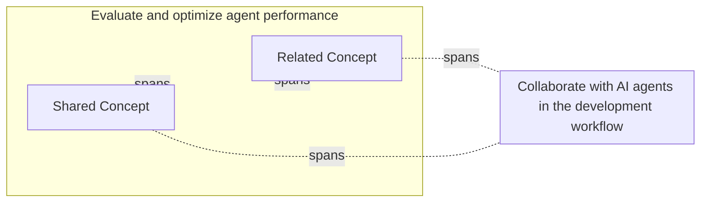

# Cross-Domain Connections

## Relationship Diagram

The following diagram shows how high-priority concepts (Priority_Score ≥ 7) relate across exam domains.

## Cross-Domain Concepts

Concepts that appear in multiple exam domains with links to their coverage in each domain.

| Concept | Domains | Priority Score |
|---------|---------|---------------|
| [Related Concept](study_notes.md#related-concept) | [Evaluate and optimize agent performance](study_notes.md#related-concept), [Collaborate with AI agents in the development workflow](study_notes.md#related-concept) | 9/10 |
| [Shared Concept](study_notes.md#shared-concept) | [Evaluate and optimize agent performance](study_notes.md#shared-concept), [Collaborate with AI agents in the development workflow](study_notes.md#shared-concept) | 8/10 |
