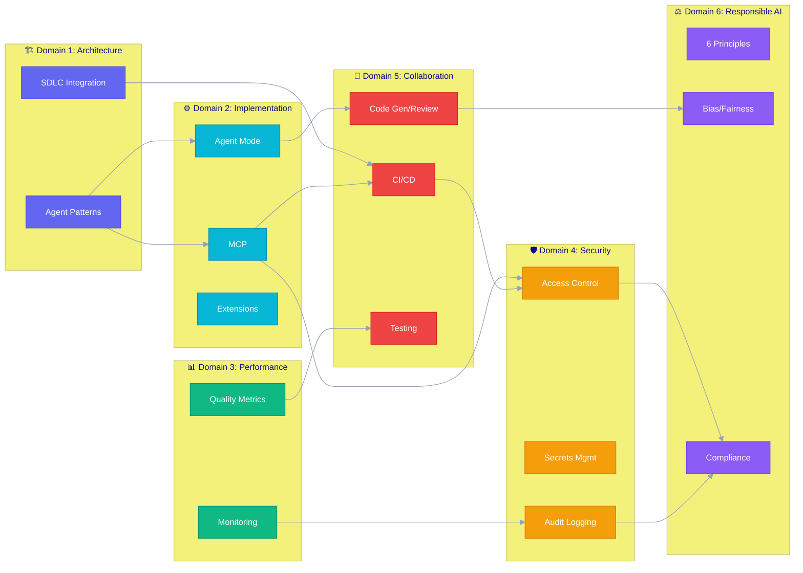
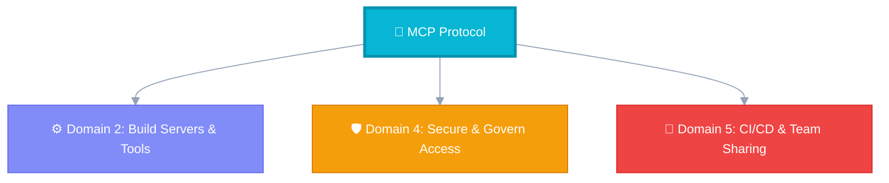

# Cross-Domain Connections

## Overview

The GH-600 exam tests integrated knowledge — concepts that span multiple domains. Understanding these connections helps you answer complex scenario-based questions that combine topics from different areas.

---

## Relationship Diagram

🔗 Arrows show how concepts from one domain connect to and depend on another

---

## Key Cross-Domain Concepts

### MCP (Domains 2, 4, 5)

| Domain | Aspect | Key Point |
|--------|--------|-----------|
| **2** | Implementation | Building servers, defining tools, configuring transport |
| **4** | Security | Permissions, secret injection, access boundaries |
| **5** | Collaboration | Using MCP tools in CI/CD, team-shared servers |

MCP is the exam's most cross-cutting topic. You need to know how to implement servers (Domain 2), secure them (Domain 4), and use them in team workflows (Domain 5).

---

### Human Oversight (Domains 1, 4, 5, 6)

| Domain | Aspect | Key Point |
|--------|--------|-----------|
| **1** | Architecture | Designing autonomy levels into agent systems |
| **4** | Security | Approval gates for sensitive operations |
| **5** | Collaboration | Human-agent interaction patterns |
| **6** | Responsible AI | Accountability principle requires human control |

Human oversight is a requirement across all domains. The exam tests whether you know WHEN human approval is needed and HOW to implement it.

---

### Security (Domains 2, 4, 5, 6)

| Domain | Aspect | Key Point |
|--------|--------|-----------|
| **2** | Implementation | Secure tool configuration, secret handling in MCP |
| **4** | Core | Access controls, permissions, audit, governance |
| **5** | CI/CD | Security scanning in pipelines, safe automation |
| **6** | Compliance | Regulatory compliance, privacy protection |

Security is never just Domain 4. Every domain has security implications that the exam tests.

---

### Performance Monitoring (Domains 3, 4, 5)

| Domain | Aspect | Key Point |
|--------|--------|-----------|
| **3** | Core | KPIs, metrics, evaluation frameworks |
| **4** | Security | Audit logs, anomaly detection |
| **5** | CI/CD | Build/test metrics, deployment success rates |

Monitoring spans observability (performance), security (audit), and process (CI/CD metrics).

---

## Integrative Themes

### Theme 1: "Defense in Depth" — Layers of Safety

Security and responsible AI create overlapping layers:

1. **Architecture Layer** (D1): Design with least privilege, proper autonomy levels
2. **Implementation Layer** (D2): Tool permissions, MCP access control
3. **Runtime Layer** (D4): Audit logging, approval gates, secret management
4. **Process Layer** (D5): CI/CD security checks, code review
5. **Governance Layer** (D6): Compliance monitoring, bias detection, incident response

### Theme 2: "Measure Everything" — Data-Driven Agent Management

| What to Measure | Why | Where |
|----------------|-----|-------|
| Task completion | Agent effectiveness | D3 |
| Security events | Threat detection | D4 |
| Bias indicators | Fairness compliance | D6 |
| CI/CD metrics | Process efficiency | D5 |
| User satisfaction | Tool adoption | D3, D5 |

### Theme 3: "Context is King" — Information Flow

How agents get, use, and protect information connects Domains 2, 4, and 5:

- **Getting context**: File reads, MCP resources, search (D2)
- **Protecting context**: Access controls, data classification (D4)
- **Sharing context**: Team-shared configs, CI/CD integration (D5)
- **Context quality**: Affects output quality and performance (D3)

---

## Exam Strategy for Cross-Domain Questions

!!! tip "Advanced Question Strategy"
    When you see a scenario-based question that mentions multiple concepts:

    1. Identify which domains are involved
    2. Check if the answer requires balancing competing concerns (security vs. usability)
    3. Look for the answer that addresses ALL mentioned domains, not just one
    4. Eliminate answers that ignore security or responsible AI requirements
    5. The correct answer usually involves multiple controls working together
