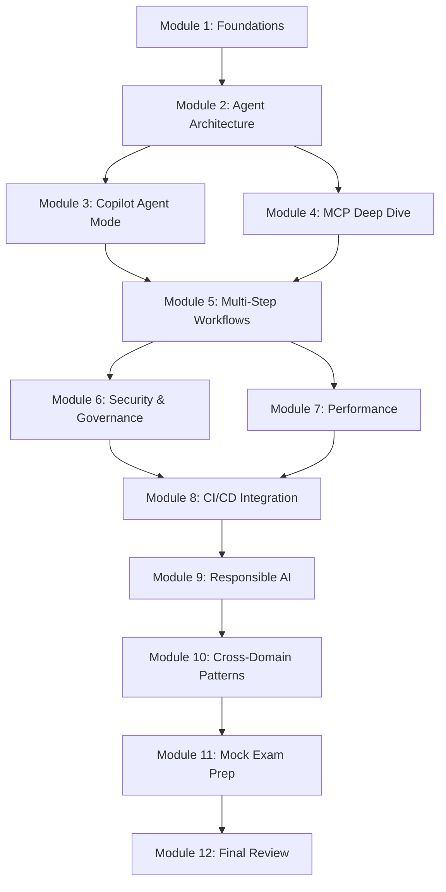

# Curriculum

## Overview

| Property | Value |
|----------|-------|
| **Total Modules** | 12 |
| **Total Study Time** | 18 hours |
| **Prerequisites** | Basic programming, Git/GitHub familiarity |
| **Format** | Self-paced with practice exercises |

!!! tip "Study Plan"
    Allocate 2-3 hours per day over one week, or 1 hour per day over 2-3 weeks. Focus on high-priority modules first.

---

## Learning Path

---

## Module 1: Foundations of Agentic AI

| Property | Value |
|----------|-------|
| **Duration** | 60 minutes |
| **Domain** | 1 (Prepare agent architecture) |
| **Priority** | High |
| **Prerequisites** | None |

### Learning Objectives

1. **Define** what an AI agent is and how it differs from a chatbot
2. **Identify** the key components of an agentic system (LLM, tools, memory, planning)
3. **Explain** the plan-execute-iterate loop used by GitHub Copilot
4. **Compare** different agent architecture patterns (single, multi, orchestrator)
5. **Describe** how agents integrate into the software development lifecycle

### Topics Covered

- What makes an AI system "agentic"
- Agent vs. assistant vs. chatbot distinctions
- The role of tools in agent autonomy
- GitHub Copilot's evolution from autocomplete to agent mode
- SDLC phases where agents add value

### Study Resources

- [Study Notes: Domain 1](study_notes.md#domain-1-prepare-agent-architecture-and-sdlc-processes)
- [Revision: Domain 1 Cheat Sheet](revision.md#domain-1-prepare-agent-architecture-and-sdlc-processes)

---

## Module 2: Agent Architecture Patterns

| Property | Value |
|----------|-------|
| **Duration** | 90 minutes |
| **Domain** | 1, 2 |
| **Priority** | High |
| **Prerequisites** | Module 1 |

### Learning Objectives

1. **Design** agent architectures appropriate for different complexity levels
2. **Evaluate** trade-offs between single-agent and multi-agent approaches
3. **Implement** orchestrator-worker patterns for complex workflows
4. **Identify** appropriate agent roles within development teams
5. **Select** frameworks and tools for specific use cases

### Topics Covered

- Single agent, multi-agent, and hierarchical patterns
- Communication patterns: request-response, event-driven, pub-sub
- Agent role assignment (code gen, review, testing, DevOps)
- Autonomy levels and when to use each
- Framework selection criteria

### Study Resources

- [Study Notes: 1.1 Architecture Patterns](study_notes.md#11-agent-architecture-patterns)
- [Study Notes: 1.3 Communication & Orchestration](study_notes.md#13-agent-communication-and-orchestration)

---

## Module 3: GitHub Copilot Agent Mode

| Property | Value |
|----------|-------|
| **Duration** | 120 minutes |
| **Domain** | 2 (Design and implement) |
| **Priority** | Critical |
| **Prerequisites** | Module 2 |

### Learning Objectives

1. **Demonstrate** how to activate and use agent mode in VS Code
2. **Implement** multi-file code generation tasks using agent mode
3. **Compare** agent mode, edit mode, and chat mode capabilities
4. **Apply** effective prompting strategies for complex tasks
5. **Evaluate** when agent mode is appropriate vs. simpler approaches

### Topics Covered

- Agent mode activation and configuration
- Tool capabilities (file read/write, terminal, search)
- Iterative error fixing and plan adjustment
- Context management and file references
- Practical exercises with multi-step coding tasks

### Study Resources

- [Study Notes: 2.1 Agent Mode](study_notes.md#21-github-copilot-agent-mode)
- [Practice Questions: Domain 2](questions.md#intermediate-questions)

---

## Module 4: Model Context Protocol (MCP)

| Property | Value |
|----------|-------|
| **Duration** | 120 minutes |
| **Domain** | 2, 4 |
| **Priority** | Critical |
| **Prerequisites** | Module 2 |

### Learning Objectives

1. **Explain** MCP architecture (host, client, server, transport)
2. **Implement** a custom MCP server with tools and resources
3. **Configure** MCP servers in development environments
4. **Distinguish** between tools, resources, and prompts in MCP
5. **Apply** security best practices to MCP deployments

### Topics Covered

- MCP protocol fundamentals (JSON-RPC 2.0, stdio/HTTP transport)
- Server configuration and tool definition
- Resource exposure and prompt templates
- Security: permissions, authentication, data boundaries
- Building custom MCP servers

### Study Resources

- [Study Notes: 2.2 MCP](study_notes.md#22-model-context-protocol-mcp)
- [Study Notes: 4.1 Access Controls](study_notes.md#41-access-controls-for-ai-agents)

---

## Module 5: Multi-Step Workflows and Extensions

| Property | Value |
|----------|-------|
| **Duration** | 90 minutes |
| **Domain** | 2 |
| **Priority** | High |
| **Prerequisites** | Module 3, Module 4 |

### Learning Objectives

1. **Design** multi-step agent workflows with error handling
2. **Implement** workflow decomposition strategies
3. **Create** GitHub Copilot extensions for custom behaviors
4. **Apply** context management best practices
5. **Evaluate** workflow efficiency and identify bottlenecks

### Topics Covered

- Workflow design principles (decomposition, checkpoints, rollback)
- Multi-step execution with validation gates
- Building Copilot extensions
- Context window management and prioritization
- Handling workflow failures gracefully

### Study Resources

- [Study Notes: 2.3 Multi-Step Workflows](study_notes.md#23-multi-step-agent-workflows)
- [Study Notes: 2.5 Extensions](study_notes.md#25-building-custom-agent-extensions)

---

## Module 6: Security and Governance

| Property | Value |
|----------|-------|
| **Duration** | 120 minutes |
| **Domain** | 4 |
| **Priority** | Critical |
| **Prerequisites** | Module 5 |

### Learning Objectives

1. **Implement** least-privilege access controls for agents
2. **Configure** agent boundaries and permission scopes
3. **Design** audit logging for agent actions
4. **Apply** data governance policies to agent interactions
5. **Manage** secrets securely in agent workflows
6. **Evaluate** security compliance of agent deployments

### Topics Covered

- Permission models (org, repo, user, session, tool level)
- Human-in-the-loop controls and approval gates
- Audit trail requirements and implementation
- Data classification and access control
- Secret management best practices
- Security monitoring and alerting

### Study Resources

- [Study Notes: Domain 4](study_notes.md#domain-4-secure-and-govern-agentic-ai-solutions)
- [Revision: Security Cheat Sheet](revision.md#domain-4-secure-and-govern-agentic-ai-solutions)

---

## Module 7: Performance Evaluation and Optimization

| Property | Value |
|----------|-------|
| **Duration** | 90 minutes |
| **Domain** | 3 |
| **Priority** | Medium |
| **Prerequisites** | Module 5 |

### Learning Objectives

1. **Measure** agent output quality using multiple dimensions
2. **Optimize** response latency for interactive workflows
3. **Implement** performance monitoring dashboards
4. **Evaluate** agent task completion rates and patterns
5. **Identify** performance degradation and root causes

### Topics Covered

- Quality metrics (correctness, completeness, code quality, security)
- Latency optimization strategies
- Monitoring KPIs and alerting thresholds
- A/B testing agent configurations
- Performance tuning parameters

### Study Resources

- [Study Notes: Domain 3](study_notes.md#domain-3-evaluate-and-optimize-agent-performance)
- [Practice Questions: Domain 3](questions.md#intermediate-questions)

---

## Module 8: CI/CD and Development Collaboration

| Property | Value |
|----------|-------|
| **Duration** | 90 minutes |
| **Domain** | 5 |
| **Priority** | High |
| **Prerequisites** | Module 6, Module 7 |

### Learning Objectives

1. **Integrate** AI agents into CI/CD pipelines effectively
2. **Implement** AI-assisted code review workflows
3. **Design** agent-enhanced testing strategies
4. **Apply** agent collaboration patterns in team workflows
5. **Automate** documentation generation with agents

### Topics Covered

- Agent integration points in CI/CD (pre-commit through deploy)
- Automated code review with AI
- Test generation and debugging with agents
- Human-agent interaction patterns
- Release automation and changelog generation

### Study Resources

- [Study Notes: Domain 5](study_notes.md#domain-5-collaborate-with-ai-agents-in-development)
- [Study Notes: 5.3 CI/CD](study_notes.md#53-ai-agents-in-cicd-pipelines)

---

## Module 9: Responsible AI Practices

| Property | Value |
|----------|-------|
| **Duration** | 90 minutes |
| **Domain** | 6 |
| **Priority** | High |
| **Prerequisites** | Module 8 |

### Learning Objectives

1. **Apply** Microsoft's 6 responsible AI principles to agent systems
2. **Implement** transparency and explainability features
3. **Identify** and mitigate bias in agent outputs
4. **Ensure** compliance with responsible AI policies
5. **Design** monitoring and auditing for responsible AI

### Topics Covered

- Six responsible AI principles (fairness, reliability, privacy, inclusiveness, transparency, accountability)
- Bias detection and mitigation strategies
- Explainability requirements for AI agents
- Compliance frameworks and checklists
- Audit logging and incident response

### Study Resources

- [Study Notes: Domain 6](study_notes.md#domain-6-implement-responsible-ai-practices)
- [Revision: Responsible AI Flashcards](revision.md#flashcards)

---

## Module 10: Cross-Domain Integration

| Property | Value |
|----------|-------|
| **Duration** | 60 minutes |
| **Domain** | All |
| **Priority** | High |
| **Prerequisites** | Module 9 |

### Learning Objectives

1. **Analyze** how concepts connect across multiple exam domains
2. **Apply** integrated knowledge to complex scenarios
3. **Evaluate** trade-offs that span multiple domains
4. **Synthesize** security, performance, and ethical considerations

### Topics Covered

- Security across all domains
- MCP in design, security, and collaboration
- Human oversight as a cross-cutting concern
- Scenario-based analysis combining multiple domains

### Study Resources

- [Cross-Domain Connections](cross_domain.md)
- [Advanced Practice Questions](questions.md#advanced-questions)

---

## Module 11: Exam Preparation and Mock Exams

| Property | Value |
|----------|-------|
| **Duration** | 120 minutes |
| **Domain** | All |
| **Priority** | Critical |
| **Prerequisites** | Module 10 |

### Learning Objectives

1. **Practice** with exam-format questions under timed conditions
2. **Identify** weak areas through mock exam analysis
3. **Apply** test-taking strategies for scenario-based questions
4. **Review** commonly tested patterns and concepts

### Activities

1. Take [Mock Exam 1](mock_exam_1.md) under timed conditions (120 min)
2. Review all incorrect answers and explanations
3. Study weak domains identified in results
4. Take [Mock Exam 2](mock_exam_2.md) to measure improvement
5. Address remaining gaps

### Study Resources

- [Mock Exams](mock_exam.md)
- [Gap Analysis](gap_report.md)

---

## Module 12: Final Review

| Property | Value |
|----------|-------|
| **Duration** | 60 minutes |
| **Domain** | All |
| **Priority** | High |
| **Prerequisites** | Module 11 |

### Learning Objectives

1. **Review** high-priority flashcards and cheat sheets
2. **Verify** readiness score meets passing threshold
3. **Confirm** understanding of key exam patterns
4. **Plan** final-day study strategy

### Activities

1. Review all [Flashcards](revision.md#flashcards) (focus on weak areas)
2. Read through [Cheat Sheets](revision.md#cheat-sheets)
3. Check [Readiness Assessment](readiness.md)
4. If score ≥ 70%: schedule exam
5. If score < 70%: revisit identified gap areas

### Study Resources

- [Revision Resources](revision.md)
- [Readiness Assessment](readiness.md)
