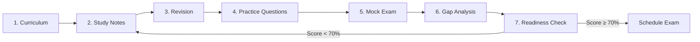

# GH-600 Exam Preparation Guide

**GitHub Certified Agentic AI Developer**

Your comprehensive study resource for mastering agentic AI development with GitHub Copilot.

---

## Exam Overview

| Property | Details |
|----------|---------|
| **Certification** | GitHub Certified Agentic AI Developer |
| **Exam Code** | GH-600 |
| **Format** | Multiple choice, multiple select, scenario-based |
| **Duration** | 120 minutes |
| **Passing Score** | 700/1000 (70%) |
| **Total Domains** | 6 |
| **Languages** | English |

!!! important "Exam Focus"
    This exam validates your ability to design, implement, secure, and optimize agentic AI solutions using GitHub Copilot and related tools. Focus on hands-on skills and real-world application patterns.

---

## Domain Breakdown

| # | Domain | Weight | Topics |
|---|--------|--------|--------|
| 1 | Prepare agent architecture and SDLC processes | 15–20% | Agent design patterns, SDLC integration, orchestration |
| 2 | Design and implement agentic solutions | 20–25% | Copilot agent mode, MCP, tools, extensions |
| 3 | Evaluate and optimize agent performance | 10–15% | Quality metrics, latency, monitoring |
| 4 | Secure and govern agentic AI solutions | 15–20% | Access control, permissions, data governance |
| 5 | Collaborate with AI agents in development | 15–20% | Code generation, debugging, CI/CD, docs |
| 6 | Implement responsible AI practices | 10–15% | Ethics, transparency, bias, compliance |

---

## Quick Links

### :material-book-open-variant: Study Materials

- [**Study Notes**](study_notes.md) — Comprehensive coverage of all 6 domains
- [**Curriculum**](curriculum.md) — Structured 12-module learning path
- [**Revision Resources**](revision.md) — Cheat sheets, flashcards, and mnemonics

### :material-clipboard-check: Practice & Assessment

- [**Practice Questions**](questions.md) — 60 questions across 3 difficulty levels
- [**Mock Exams**](mock_exam.md) — Full-length timed practice exams
- [**Gap Analysis**](gap_report.md) — Identify weak areas
- [**Readiness Assessment**](readiness.md) — Final readiness score and study plan

### :material-connection: Connections

- [**Cross-Domain Map**](cross_domain.md) — How concepts connect across domains

---

## Study Path

!!! tip "Recommended Approach"
    Follow this sequence for optimal retention and exam readiness.

1. **Review the [Curriculum](curriculum.md)** — Understand the learning path and time commitments
2. **Study domain by domain** using [Study Notes](study_notes.md) — Deep-dive into each topic
3. **Quick review** with [Revision Resources](revision.md) — Flashcards, cheat sheets, mnemonics
4. **Test yourself** with [Practice Questions](questions.md) — Easy → Intermediate → Advanced
5. **Simulate the exam** with [Mock Exams](mock_exam.md) — Timed, scored, with explanations
6. **Analyze gaps** via [Gap Report](gap_report.md) — Target weak areas for focused study
7. **Check readiness** in [Readiness Assessment](readiness.md) — Get your go/no-go recommendation

---

## Key Concepts to Master

!!! note "High-Priority Topics"
    These topics carry the most weight on the exam. Prioritize them in your study plan.

| Topic | Domain | Why It Matters |
|-------|--------|---------------|
| GitHub Copilot Agent Mode | 2, 5 | Core feature — multi-step autonomous coding |
| Model Context Protocol (MCP) | 2, 4 | Standard for tool integration with LLMs |
| Responsible AI Principles | 6, 4 | Ethics, transparency, bias mitigation |
| Agent Security & Permissions | 4, 2 | Access control, least privilege, secrets |
| CI/CD with AI Agents | 5, 1 | Automated testing, deployment, code review |
| Performance Evaluation | 3, 5 | Metrics, monitoring, optimization |

---

## About This Resource

This study guide was built specifically for the GH-600 certification exam. It covers all six domains with detailed explanations, practical examples, code snippets, and exam-focused tips. The content is organized to support both linear study (following the curriculum) and targeted review (jumping to specific topics).

!!! warning "Disclaimer"
    This is an independent study resource. Always refer to the [official Microsoft Learn study guide](https://learn.microsoft.com/en-us/credentials/certifications/resources/study-guides/gh-600) for the most current exam objectives.
