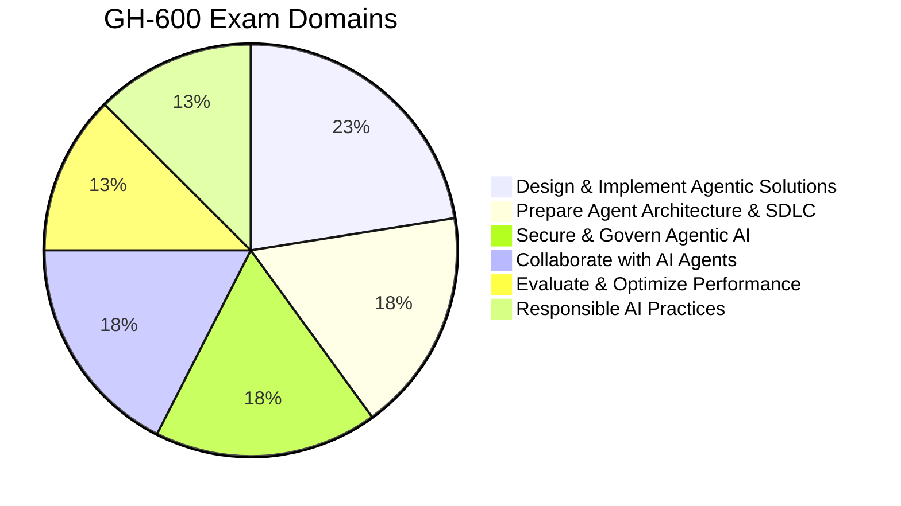
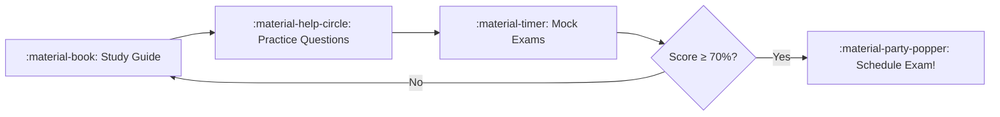

---
hide:
  - navigation
  - toc
---

# :material-robot-excited: Pass the GH-600 Exam

**GitHub Certified Agentic AI Developer**
{ .hero-subtitle }

Your focused, no-fluff study system. Master all 6 domains. Score 70%+. Get certified.

[Start Studying :material-arrow-right:](study_notes.md){ .md-button .md-button--primary }
[Practice Questions](questions.md){ .md-button }

---

## :material-clipboard-text: Exam Quick Facts

| | |
|---|---|
| **Exam Code** | GH-600 |
| **Duration** | 120 minutes |
| **Passing Score** | 70% (700/1000) |
| **Questions** | ~50 (multiple choice, multi-select, scenario) |
| **Cost** | $99 USD |
| **Language** | English |

---

## :material-chart-pie: Domain Weights

---

## :material-map-marker-path: Your Study Path

| Phase | Resource | Goal |
|-------|----------|------|
| 1. Learn | [Study Guide](study_notes.md) | Master all 6 domains |
| 2. Practice | [Practice Questions](questions.md) | Test recall & application |
| 3. Simulate | [Mock Exams](mock_exam.md) | Build exam stamina |
| 4. Repeat | Loop back if <70% | Target weak domains |

---

## :material-checkbox-marked-outline: Progress Tracker

<!-- JS will render interactive checkboxes here -->

---

## :material-view-grid: Domain Overview

!!! abstract "Domain 1 — Prepare Agent Architecture & SDLC (15–20%)"

    - Agent design patterns (ReAct, tool-use, planning)
    - SDLC integration & orchestration strategies
    - Selecting appropriate agent frameworks

!!! example "Domain 2 — Design & Implement Agentic Solutions (20–25%) :material-star:"

    - GitHub Copilot Agent Mode & multi-step workflows
    - Model Context Protocol (MCP) servers & tools
    - Copilot Extensions & custom agents

!!! warning "Domain 3 — Evaluate & Optimize Performance (10–15%)"

    - Quality metrics & evaluation frameworks
    - Latency optimization & cost management
    - Monitoring & observability for agents

!!! danger "Domain 4 — Secure & Govern Agentic AI (15–20%)"

    - Access control & least-privilege for agents
    - Secret management & permission boundaries
    - Data governance & compliance

!!! info "Domain 5 — Collaborate with AI Agents (15–20%)"

    - AI-assisted code generation & debugging
    - CI/CD pipeline integration
    - Documentation & knowledge management with AI

!!! success "Domain 6 — Responsible AI Practices (10–15%)"

    - Transparency & explainability
    - Bias detection & mitigation
    - Human oversight & ethical guardrails

---

## :material-target: Key Concepts to Master

| Topic | Domains | Priority |
|-------|---------|----------|
| GitHub Copilot Agent Mode | 2, 5 | :material-alert-circle:{ .high } Critical |
| Model Context Protocol (MCP) | 2, 4 | :material-alert-circle:{ .high } Critical |
| Agent Security & Permissions | 4, 1 | :material-alert:{ .high } High |
| Responsible AI Principles | 6, 4 | :material-alert:{ .high } High |
| CI/CD with AI Agents | 5, 1 | :material-alert:{ .medium } Medium-High |
| Performance Metrics & Evaluation | 3, 5 | :material-alert:{ .medium } Medium-High |
| Copilot Extensions Architecture | 2, 5 | :material-alert:{ .medium } Medium-High |
| Agent Design Patterns (ReAct, CoT) | 1, 2 | :material-alert:{ .medium } Medium-High |

---

??? tip "Quick Tips for Exam Day :material-lightbulb:"

    **Before the exam:**

    - :material-sleep: Get 7–8 hours of sleep the night before
    - :material-food: Eat a proper meal — the exam is 2 hours
    - :material-identifier: Have your government-issued ID ready
    - :material-monitor: Test your webcam, mic, and internet if taking online

    **During the exam:**

    - :material-clock-outline: Budget ~2.4 minutes per question — don't stall
    - :material-flag: Flag difficult questions and come back
    - :material-cancel: Eliminate obviously wrong answers first
    - :material-book-open: Read scenario questions carefully — keywords matter
    - :material-shield-check: When in doubt, choose the most **secure** and **least-privilege** option

    **Strategy:**

    - Focus on Domains 2 & 4 — they carry the most weight combined
    - Scenario questions test *application*, not memorization
    - MCP and Agent Mode appear across multiple domains — know them cold

---

!!! quote "Disclaimer"

    This is an independent study resource. For the most current exam objectives, always refer to the [official Microsoft Learn study guide for GH-600](https://learn.microsoft.com/en-us/credentials/certifications/resources/study-guides/gh-600). Exam content may change without notice.
