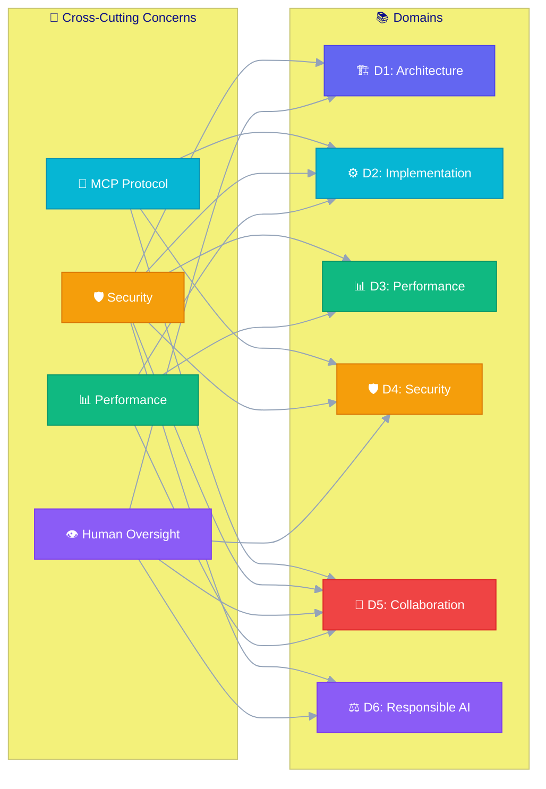

# Quick Reference

## Flashcards

!!! info "How to Use"
    Click any card to flip it and reveal the answer. Use these for spaced repetition practice.

🔌 What are the four MCP components?

<strong>Host</strong> (app running the model), <strong>Client</strong> (connection manager), <strong>Server</strong> (exposes tools/resources/prompts), <strong>Transport</strong> (stdio or HTTP/SSE)

🌐 What transport protocols does MCP use?

JSON-RPC 2.0 over <strong>stdio</strong> (local processes) or <strong>HTTP with Server-Sent Events (SSE)</strong> (remote servers)

🤖 What distinguishes Agent Mode from Chat mode?

Agent Mode is <strong>autonomous and multi-step</strong>: creates/edits files, runs terminal commands, iterates on failures, uses entire workspace. Chat gives a single response without tool use.

🔄 What is the plan-execute-iterate loop?

(1) <strong>Plan</strong> steps from user request, (2) <strong>Execute</strong> each step using tools, (3) <strong>Iterate</strong> — adjust plan based on results/errors until complete

🔒 Name the 5 access control levels (top → bottom)

<strong>O</strong>rganization → <strong>R</strong>epository → <strong>U</strong>ser → <strong>S</strong>ession → <strong>T</strong>ool (ORUST)

🛡️ What is least privilege for agents?

Agents should only access the resources and permissions they need for their <strong>current task</strong> — no more. Deny by default.

🔑 How should secrets be handled in agent workflows?

Reference by <strong>name</strong> (env vars), never by value. Use vault services (GitHub Secrets, Azure Key Vault). Enable secret scanning. Never hardcode.

⚖️ What are Microsoft's 6 Responsible AI principles?

<strong>T</strong>ransparency, <strong>F</strong>airness, <strong>R</strong>eliability & Safety, <strong>I</strong>nclusiveness, <strong>P</strong>rivacy & Security, <strong>A</strong>ccountability (TFRIPA)

⚠️ What are the tool risk categories?

<strong>R</strong>ead (safe) → <strong>W</strong>rite (review) → <strong>S</strong>hell (highest, explicit consent) → <strong>N</strong>etwork (data exposure)

🧰 What are the 3 MCP server capability types?

<strong>Tools</strong> (actions to execute), <strong>Resources</strong> (data to read), <strong>Prompts</strong> (reusable templates)

✋ When should an agent require human approval?

File deletion, package installation, config changes, deployment, accessing production, and any terminal commands that modify state

🧠 What is context window management?

Prioritizing what fits in the token limit. Order: user request > explicit references > active file > semantic search > project structure

📊 What metrics define good agent performance?

Completion >85%, Acceptance >75%, Iterations <5, Errors <5%, Latency p95 <5s

⚡ How does streaming reduce perceived latency?

Sends output tokens as generated rather than waiting for full response. Users see results immediately even if total time is the same.

📁 What data classification levels apply to agents?

<strong>Public</strong> (unrestricted) → <strong>Internal</strong> (with auth) → <strong>Confidential</strong> (encrypted) → <strong>Restricted</strong> (never exposed to agents)

📝 What makes a good agent prompt?

Specific, constrained, provides context. Example: "Create a Python function that validates email using regex, returns bool, handles + aliases"

👁️ What is the role of human oversight?

Agents suggest → humans approve (production). Agents generate → humans review (code). Agents monitor → humans decide (incidents). Agents flag → humans investigate (security).

🧩 What are GitHub Copilot Extensions?

Custom agents invoked via <strong>@mentions</strong> in Copilot Chat. Extend Copilot with domain-specific knowledge via an HTTP endpoint.

🔄 How do agents integrate into CI/CD?

Pre-commit (auto-fix), Build (optimize), Test (generate tests), Review (auto PR review), Release (changelogs), Deploy (validation). Never auto-deploy to prod.

🎭 What is bias in AI agent outputs?

Training data, cultural, gender, accessibility, language bias. Mitigate with inclusive language (main not master, allowlist not whitelist) and diverse testing.

---

## Mnemonics

### TFRIPA — Six Responsible AI Principles

| Letter | Principle | Remember |
|--------|-----------|----------|
| **T** | Transparency | Tell users what you're doing |
| **F** | Fairness | Fair treatment for all |
| **R** | Reliability & Safety | Reliable, safe behavior |
| **I** | Inclusiveness | Include everyone |
| **P** | Privacy & Security | Protect data |
| **A** | Accountability | Always have human oversight |

### ORUST — Permission Levels (top → bottom)

| Letter | Level | Remember |
|--------|-------|----------|
| **O** | Organization Policy | Org sets the rules |
| **R** | Repository Settings | Repo-level controls |
| **U** | User Permissions | User-specific access |
| **S** | Session Scope | Scoped per invocation |
| **T** | Tool-Level Access | Tool approval required |

### RWSN — Tool Risk Categories (lowest → highest)

| Letter | Category | Risk Level |
|--------|----------|-----------|
| **R** | Read | Safe — no approval needed |
| **W** | Write | Medium — requires review |
| **S** | Shell | High — explicit consent |
| **N** | Network | High — data exposure risk |

### HCST — MCP Components

| Letter | Component | Role |
|--------|-----------|------|
| **H** | Host | Application running the AI model |
| **C** | Client | Protocol handler / connection manager |
| **S** | Server | Exposes tools, resources, prompts |
| **T** | Transport | Communication layer (stdio/HTTP+SSE) |

### PEI — Agent Loop

| Letter | Phase | What Happens |
|--------|-------|-------------|
| **P** | Plan | Analyze request, create steps |
| **E** | Execute | Run tools, modify files, run commands |
| **I** | Iterate | Check results, fix errors, repeat |

---

## Cheat Sheet Tables

### Domain 1: Agent Architecture & SDLC

| Concept | Key Facts |
|---------|-----------|
| Single Agent | One LLM + tools, simple tasks |
| Multi-Agent | Specialized agents, complex workflows |
| Orchestrator-Worker | Central coordinator delegates |
| Autonomy Levels | Full (formatting) → Supervised (deploy) → Advisory (architecture) |
| SDLC Phases | Plan → Code → Test → Review → Deploy → Monitor |
| Agent ≠ Assistant | Agents have autonomy, state, tool use, error recovery |

### Domain 2: Design & Implementation

| Concept | Key Facts |
|---------|-----------|
| Agent Mode | Multi-step, autonomous, full tool access, workspace context |
| Chat Mode | Single response, limited tools, conversation context |
| MCP Protocol | JSON-RPC 2.0, stdio or HTTP/SSE transport |
| MCP Tools | Actions agent can execute (functions) |
| MCP Resources | Data agent can read (files, APIs) |
| MCP Prompts | Reusable prompt templates |
| Workflow Design | Decompose → Error handle → Checkpoint → Validate → Rollback |
| Extensions | @mention invocation, HTTP endpoint, domain-specific |

### Domain 3: Performance & Optimization

| Concept | Key Facts |
|---------|-----------|
| Latency Targets | Inline <200ms, Chat <2s, Agent step <10s, Full task <5min |
| Streaming | Primary technique for perceived speed |
| Task Completion | Target >85%, alert <70% |
| User Acceptance | Target >75% |
| Avg Iterations | Target <5, warning >10 |
| Optimization | Cache, smaller models, context pruning, parallel tool calls |

### Domain 4: Security & Governance

| Concept | Key Facts |
|---------|-----------|
| Least Privilege | Only access what's needed for current task |
| Permission Levels | Org → Repo → User → Session → Tool |
| Sensitive Files | .env, secrets/, *.key — always deny agent access |
| Audit Logs | Timestamp, user, session, action, target, approval status |
| Data Classification | Public → Internal → Confidential → Restricted |
| Secrets | Reference by name, never by value; use vaults |

### Domain 5: Collaboration

| Concept | Key Facts |
|---------|-----------|
| Code Gen Patterns | Prompt-driven, test-first, refactor, pattern-extension, docs-first |
| Effective Prompts | Specific, constrained, provide context |
| CI/CD Integration | Lint-fix, test-gen, PR review, release notes, deploy validation |
| Never Auto-deploy | Production requires human approval always |
| Interaction Patterns | Direct, iterative, constraint-setting, example-driven, exploratory |

### Domain 6: Responsible AI

| Concept | Key Facts |
|---------|-----------|
| 6 Principles | Transparency, Fairness, Reliability, Inclusiveness, Privacy, Accountability |
| Bias Types | Training data, cultural, gender, accessibility, language |
| Inclusive Terms | main (not master), replica (not slave), allowlist/denylist |
| Transparency | Disclose AI content, explain reasoning, show confidence, cite sources |
| Compliance | GDPR/CCPA, audit logs, opt-out mechanisms, incident response |
| Monitoring | Content safety, fairness metrics, compliance logs, alerting |

---

## Cross-Domain Connections

| Cross-Domain Theme | Where It Appears | Key Insight |
|-------------------|------------------|-------------|
| **MCP** | D2 (implement), D4 (secure), D5 (CI/CD) | One protocol, multiple security and implementation concerns |
| **Security** | All 6 domains | Not just Domain 4 — secure architecture, secure tools, secure pipelines, compliance |
| **Human Oversight** | D1 (autonomy levels), D4 (approval gates), D5 (review), D6 (accountability) | Every domain requires human decision points for high-risk actions |
| **Performance** | D2 (streaming), D3 (core metrics), D5 (CI/CD speed) | Balance thoroughness with speed; streaming is universal solution for latency |
| **Context Management** | D2 (context window), D3 (optimization), D4 (data boundaries) | What the agent sees determines quality AND security |
| **Tool Permissions** | D2 (tool categories), D4 (least privilege), D5 (CI/CD safety) | RWSN risk model applies everywhere tools are used |
