# Study Notes

## About This Guide

This comprehensive study guide covers all six domains of the **GitHub Certified Agentic AI Developer (GH-600)** certification exam. It provides detailed explanations, code examples, Mermaid diagrams, and exam tips for each topic. Use this as your primary reference for understanding agent architecture, MCP, security, performance optimization, collaboration patterns, and responsible AI practices in the GitHub ecosystem.

## Domain Weight Summary

| Domain | Topic | Weight | Priority |
|--------|-------|--------|----------|
| 1 | Prepare Agent Architecture and SDLC Processes | 15–20% | :material-star: :material-star: :material-star: |
| 2 | Design and Implement Agentic Solutions | 20–25% | :material-star: :material-star: :material-star: :material-star: |
| 3 | Evaluate and Optimize Agent Performance | 10–15% | :material-star: :material-star: |
| 4 | Secure and Govern Agentic AI Solutions | 15–20% | :material-star: :material-star: :material-star: |
| 5 | Collaborate with AI Agents in Development | 15–20% | :material-star: :material-star: :material-star: |
| 6 | Implement Responsible AI Practices | 10–15% | :material-star: :material-star: |

!!! info "Study Strategy"
    Domain 2 carries the most weight — allocate proportionally more study time to MCP, agent mode, and multi-step workflows. Domains 1, 4, and 5 are equally weighted and together make up 45–60% of the exam.

## Table of Contents

- [Domain 1: Prepare Agent Architecture and SDLC Processes](#domain-1-prepare-agent-architecture-and-sdlc-processes) — Architecture patterns, SDLC integration, orchestration
- [Domain 2: Design and Implement Agentic Solutions](#domain-2-design-and-implement-agentic-solutions) — Agent mode, MCP, workflows, tools, extensions
- [Domain 3: Evaluate and Optimize Agent Performance](#domain-3-evaluate-and-optimize-agent-performance) — Quality metrics, latency, monitoring
- [Domain 4: Secure and Govern Agentic AI Solutions](#domain-4-secure-and-govern-agentic-ai-solutions) — Access controls, permissions, secrets, compliance
- [Domain 5: Collaborate with AI Agents in Development](#domain-5-collaborate-with-ai-agents-in-development) — Code generation, debugging, CI/CD, interaction patterns
- [Domain 6: Implement Responsible AI Practices](#domain-6-implement-responsible-ai-practices) — Ethics, transparency, bias, compliance, auditing
- [Quick Reference](quick_reference.md) — Flashcards, mnemonics, cheat sheets, cross-domain connections

---

## Domain 1: Prepare Agent Architecture and SDLC Processes

**Weight: 15–20% of exam**

### 1.1 Agent Architecture Patterns

#### Overview

Agent architecture defines how AI agents are structured, how they communicate, and how they fit within software systems. In the GitHub ecosystem, agents operate as autonomous or semi-autonomous components that can plan, execute, and iterate on development tasks.

!!! quote "Official Sources"
    - [Azure AI Agent Architecture](https://learn.microsoft.com/en-us/azure/ai-services/agents/concepts/agents)
    - [GitHub Copilot Agent Mode Overview](https://docs.github.com/en/copilot/using-github-copilot/using-agent-mode-in-github-copilot)

#### Key Architecture Patterns

| Pattern | Description | Use Case |
|---------|-------------|----------|
| **Single Agent** | One LLM with tools | Simple code generation, single-file edits |
| **Multi-Agent** | Multiple specialized agents | Complex workflows, code review + testing |
| **Orchestrator-Worker** | Central coordinator delegates tasks | Large-scale refactoring, multi-step pipelines |
| **Hierarchical** | Agents supervise sub-agents | Enterprise workflows with approval chains |

#### How GitHub Copilot Implements Agent Architecture

GitHub Copilot agent mode uses a **plan-execute-iterate** loop:

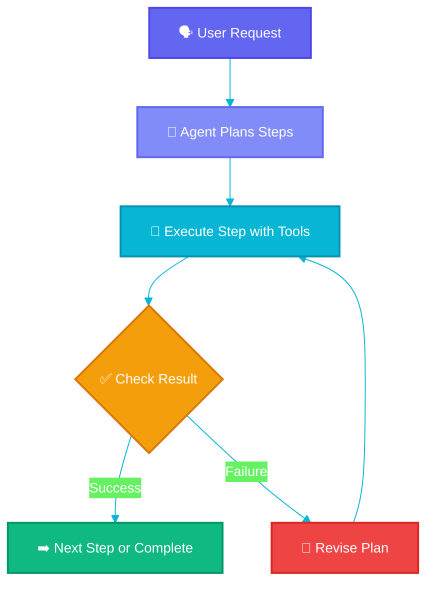

1. **Planning**: The agent analyzes the request and creates a multi-step plan
2. **Tool Selection**: Chooses appropriate tools (file read/write, terminal, search)
3. **Execution**: Runs each step, observing results
4. **Iteration**: Adjusts plan based on outcomes (errors, test failures)

#### Detailed Explanation

Agentic AI architecture in GitHub represents a paradigm shift from simple code completion to autonomous task execution. An agent is an LLM-powered system that can reason about problems, break them into sub-tasks, use tools to interact with the environment, and iterate based on feedback.

The key distinction between a simple AI assistant and an agent is **autonomy**. While a basic assistant responds to a single prompt, an agent:

- Maintains state across multiple interactions
- Makes decisions about which tools to use
- Can recover from errors without human intervention
- Produces verifiable outputs (code that compiles, tests that pass)

In the GitHub SDLC context, agents participate at multiple stages:

- **Design**: Suggesting architecture, generating diagrams
- **Implementation**: Writing code, creating files, running commands
- **Testing**: Writing and executing tests, fixing failures
- **Review**: Analyzing code quality, suggesting improvements
- **Deployment**: Configuring CI/CD, managing releases

!!! tip "Exam Tip"
    The exam tests whether you understand the *boundaries* of agent autonomy. Know when an agent should act independently vs. when it should ask for human approval.

#### Common Mistakes

!!! warning "Avoid These"
    - Assuming agents can replace all human decision-making in SDLC
    - Confusing agent mode (autonomous multi-step) with chat mode (single response)
    - Ignoring the need for human oversight in production-impacting changes

---

### 1.2 SDLC Integration Points for AI Agents

#### Overview

AI agents integrate into the Software Development Lifecycle at specific touchpoints where they add the most value. Understanding these integration points is critical for designing effective agentic workflows.

!!! quote "Official Sources"
    - [GitHub Copilot Features Across the SDLC](https://docs.github.com/en/copilot/about-github-copilot/github-copilot-features)

#### Integration Points by SDLC Phase

| Phase | Agent Capability | Example |
|-------|-----------------|---------|
| **Planning** | Requirements analysis, story decomposition | Breaking epics into implementable tasks |
| **Design** | Architecture suggestions, API design | Generating OpenAPI specs from descriptions |
| **Coding** | Code generation, refactoring, file creation | Implementing features across multiple files |
| **Testing** | Test generation, bug reproduction | Writing unit tests, finding edge cases |
| **Review** | Code review, security scanning | Identifying vulnerabilities, style issues |
| **Deploy** | CI/CD config, release notes | Generating changelogs, configuring workflows |
| **Monitor** | Log analysis, incident response | Summarizing error patterns, suggesting fixes |

#### Agent Mode in the IDE

GitHub Copilot's agent mode transforms the IDE into an autonomous development environment:

```yaml
# Agent mode capabilities in VS Code / IDE
capabilities:
  - file_creation: Create new files and directories
  - file_editing: Modify existing source code
  - terminal_execution: Run shell commands
  - search: Find code patterns across the codebase
  - web_browsing: Fetch documentation (with MCP)
  - test_running: Execute and verify tests
```

#### How Agents Fit the SDLC

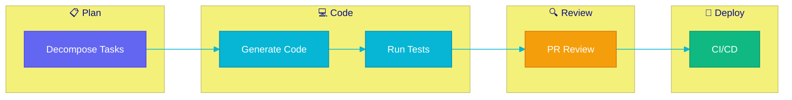

!!! tip "Exam Tip"
    Know which agent capabilities map to which SDLC phases. The exam may present scenarios asking where agent intervention is most appropriate.

---

### 1.3 Agent Communication and Orchestration

#### Overview

When multiple agents or agent components work together, they need clear communication protocols and orchestration strategies. This topic covers how agents coordinate within GitHub workflows.

!!! quote "Official Sources"
    - [Model Context Protocol Specification](https://spec.modelcontextprotocol.io/)

#### Communication Patterns

| Pattern | Description | When to Use |
|---------|-------------|------------|
| **Request-Response** | Agent asks, tool responds | File operations, API calls |
| **Event-Driven** | Agent reacts to triggers | PR opened, test failed, file changed |
| **Publish-Subscribe** | Agents broadcast status | Multi-agent coordination |
| **Shared Context** | Agents read/write shared state | Complex multi-step workflows |

#### Orchestration with GitHub Actions

```yaml
# Example: Agent-orchestrated CI/CD workflow
name: Agent-Assisted Development
on:
  pull_request:
    types: [opened, synchronize]

jobs:
  agent-review:
    runs-on: ubuntu-latest
    steps:
      - uses: actions/checkout@v4
      - name: AI Code Review
        uses: github/copilot-review-action@v1
        with:
          model: gpt-4
          scope: changed-files
      - name: AI Test Generation
        uses: github/copilot-test-gen@v1
        with:
          coverage_target: 80%
```

#### Key Facts

- Agents communicate through **tool calls** (function invocations with structured inputs/outputs)
- GitHub Copilot uses a **message-based protocol** between the IDE and the AI backend
- MCP (Model Context Protocol) standardizes how agents interact with external tools
- Agent orchestration respects **rate limits** and **token budgets**

!!! warning "Common Mistake"
    Don't confuse agent-to-agent communication with user-to-agent communication. The exam distinguishes between how agents talk to tools (MCP/function calls) versus how users interact with agents (natural language prompts).

---

### 1.4 Agent Roles Within Development Workflows

#### Overview

Different agents serve different roles within a development team's workflow. Understanding these roles helps you design systems where each agent has a clear responsibility.

!!! quote "Official Sources"
    - [GitHub Copilot Agent Capabilities](https://docs.github.com/en/copilot/using-github-copilot/using-agent-mode-in-github-copilot)

#### Agent Roles

| Role | Responsibility | Autonomy Level |
|------|---------------|----------------|
| **Code Generator** | Write new code from specs | High — generates, tests, iterates |
| **Code Reviewer** | Analyze PRs for quality/security | Medium — suggests, doesn't merge |
| **Test Writer** | Create and maintain test suites | High — writes, runs, fixes |
| **Documentation Agent** | Generate/update docs | Medium — drafts, human reviews |
| **DevOps Agent** | Configure CI/CD, manage infra | Low — proposes, human approves |
| **Security Scanner** | Find vulnerabilities | Medium — flags, suggests fixes |

#### Autonomy Levels

```
┌─────────────────────────────────────────────────────┐
│ Full Autonomy: Agent acts without human approval    │
│   Examples: Code formatting, test execution         │
├─────────────────────────────────────────────────────┤
│ Supervised: Agent proposes, human approves          │
│   Examples: PR merge, deployment, config changes    │
├─────────────────────────────────────────────────────┤
│ Advisory: Agent suggests, human decides             │
│   Examples: Architecture decisions, feature design  │
└─────────────────────────────────────────────────────┘
```

!!! tip "Exam Tip"
    The exam frequently tests your ability to assign the correct autonomy level to an agent role. Remember: higher risk = lower autonomy = more human oversight.

---

### 1.5 Selecting Agent Frameworks and Tools

#### Overview

Choosing the right framework determines how effectively agents operate. GitHub's ecosystem provides specific tools optimized for agentic development.

!!! quote "Official Sources"
    - [Copilot Extensions Ecosystem](https://docs.github.com/en/copilot/using-github-copilot/using-extensions-to-integrate-external-tools-with-copilot-chat)

#### Framework Comparison

| Framework/Tool | Best For | Key Feature |
|---------------|----------|-------------|
| **GitHub Copilot Agent Mode** | IDE-based development | Built-in tool use, file editing |
| **GitHub Copilot Extensions** | Custom agent behaviors | Domain-specific agents |
| **GitHub Actions + AI** | CI/CD automation | Event-driven agent triggers |
| **MCP Servers** | Tool integration | Standardized tool protocol |
| **Custom GPT Agents** | Specialized workflows | Fine-tuned for specific tasks |

#### Selection Criteria

When selecting an agent framework, consider:

1. **Task Complexity**: Simple tasks → Copilot Chat; Complex multi-step → Agent Mode
2. **Integration Needs**: Need external tools? → MCP; GitHub-native? → Actions
3. **Security Requirements**: Sensitive data? → On-premise; Public code? → Cloud
4. **Team Size**: Solo developer → Agent Mode; Enterprise → Custom Extensions
5. **Customization**: Off-the-shelf → Copilot; Custom behavior → Extensions + MCP

```python
# Example: Choosing agent configuration based on task
def select_agent_config(task):
    if task.complexity == "simple" and task.scope == "single_file":
        return AgentConfig(mode="chat", tools=["code_completion"])
    elif task.complexity == "complex" and task.scope == "multi_file":
        return AgentConfig(mode="agent", tools=["file_edit", "terminal", "search"])
    elif task.requires_external_data:
        return AgentConfig(mode="agent", tools=["mcp_server"], mcp_servers=task.servers)
```

!!! note "Key Takeaway"
    GitHub Copilot agent mode is the primary tool for the GH-600 exam. Understand when to use it vs. extensions vs. Actions-based automation.

---

## Domain 2: Design and Implement Agentic Solutions

**Weight: 20–25% of exam** (highest-weighted domain)

### MCP Architecture Overview

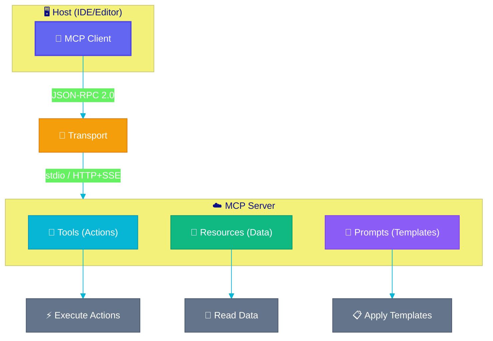

<p class="diagram-caption">🔌 MCP connects AI hosts to tool servers via a standardized JSON-RPC protocol</p>

### 2.1 GitHub Copilot Agent Mode

#### Overview

Agent mode is Copilot's autonomous coding capability. Unlike chat (single response) or inline suggestions (autocomplete), agent mode executes multi-step tasks: editing files, running commands, fixing errors, and iterating until the task is complete.

!!! quote "Official Sources"
    - [GitHub Copilot Agent Mode](https://docs.github.com/en/copilot/using-github-copilot/using-agent-mode-in-github-copilot)
    - [VS Code Agent Mode](https://code.visualstudio.com/docs/copilot/chat/chat-agent-mode)

#### Agent Mode vs. Other Modes

| Feature | Inline Suggestions | Chat | Agent Mode |
|---------|-------------------|------|-----------|
| Autonomy | None (you accept/reject) | Low (responds once) | High (multi-step) |
| Tool Use | No | Limited | Full (files, terminal, search) |
| Iteration | No | Manual follow-ups | Automatic |
| Context | Current file | Conversation | Entire workspace |
| File Edits | Single line/block | Suggests code | Creates/edits files directly |

#### How Agent Mode Works

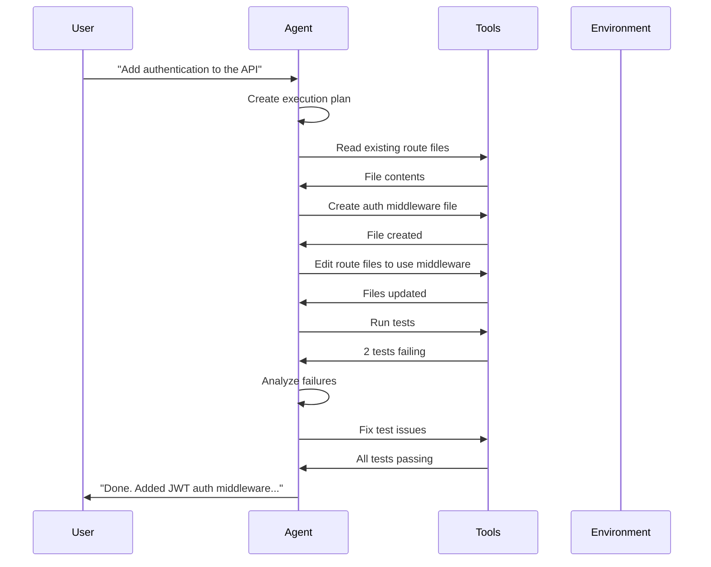

#### Activating Agent Mode

In VS Code with GitHub Copilot:
- Open the Copilot Chat panel
- Select **Agent** mode (not Chat or Edit)
- Type a complex, multi-step request
- The agent will request tool approvals as it works

#### Key Capabilities

1. **File Operations**: Create, read, edit, delete files across the project
2. **Terminal Commands**: Run builds, tests, linters, installers
3. **Search**: Find code patterns, symbols, references across the workspace
4. **Web Fetch**: Access documentation via MCP servers
5. **Iterative Fixing**: Automatically fix build errors and test failures
6. **Context Awareness**: Understands project structure, dependencies, patterns

#### Code Example: Agent Mode Task

```typescript
// User prompt to agent mode:
// "Create a REST API endpoint for user registration with validation"

// Agent creates: src/routes/auth.ts
import { Router, Request, Response } from 'express';
import { body, validationResult } from 'express-validator';
import bcrypt from 'bcrypt';
import { User } from '../models/user';

const router = Router();

// Validation middleware
const registerValidation = [
  body('email').isEmail().normalizeEmail(),
  body('password').isLength({ min: 8 })
    .matches(/^(?=.*[A-Z])(?=.*[0-9])/),
  body('name').trim().notEmpty(),
];

// POST /auth/register
router.post('/register', registerValidation, async (req: Request, res: Response) => {
  const errors = validationResult(req);
  if (!errors.isEmpty()) {
    return res.status(400).json({ errors: errors.array() });
  }

  const { email, password, name } = req.body;
  const hashedPassword = await bcrypt.hash(password, 12);

  const user = await User.create({ email, password: hashedPassword, name });
  return res.status(201).json({ id: user.id, email: user.email });
});

export default router;
```

!!! tip "Exam Tip"
    Know the difference between agent mode, edit mode, and chat mode. Agent mode is the only one that can autonomously create files, run terminal commands, and iterate on failures.

#### Common Mistakes

!!! warning "Avoid These"
    - Using agent mode for simple single-line completions (overkill)
    - Not reviewing agent-generated code before committing
    - Expecting agents to handle production deployments without oversight
    - Forgetting that agent mode requires tool approval for sensitive operations

---

### 2.2 Model Context Protocol (MCP)

#### Overview

MCP is an open standard that defines how AI models connect to external tools and data sources. It provides a unified protocol for agents to discover, invoke, and receive results from tools — similar to how HTTP standardized web communication.

!!! quote "Official Sources"
    - [MCP Specification](https://spec.modelcontextprotocol.io/)
    - [MCP Introduction](https://modelcontextprotocol.io/introduction)
    - [GitHub Copilot MCP Integration](https://docs.github.com/en/copilot/customizing-copilot/extending-copilot-chat-with-mcp)

#### MCP Architecture

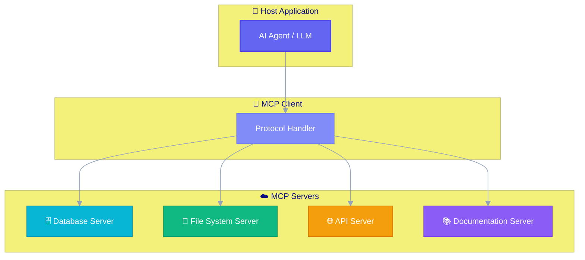

#### MCP Components

| Component | Role | Example |
|-----------|------|---------|
| **Host** | Application running the AI model | VS Code, IDE |
| **Client** | Maintains connection to servers | Built into Copilot |
| **Server** | Exposes tools, resources, prompts | Custom tool server |
| **Transport** | Communication layer | stdio, HTTP/SSE |

#### MCP Server Configuration

```json
{
  "mcpServers": {
    "filesystem": {
      "command": "npx",
      "args": ["-y", "@modelcontextprotocol/server-filesystem", "/workspace"],
      "env": {}
    },
    "postgres": {
      "command": "npx",
      "args": ["-y", "@modelcontextprotocol/server-postgres"],
      "env": {
        "DATABASE_URL": "postgresql://localhost/mydb"
      }
    },
    "github": {
      "command": "npx",
      "args": ["-y", "@modelcontextprotocol/server-github"],
      "env": {
        "GITHUB_TOKEN": "${GITHUB_TOKEN}"
      }
    }
  }
}
```

#### MCP Capabilities

1. **Tools**: Functions the agent can call (e.g., `query_database`, `read_file`)
2. **Resources**: Data the agent can access (e.g., file contents, API responses)
3. **Prompts**: Pre-built prompt templates for common tasks
4. **Sampling**: Server can request LLM completions from the host

#### Tool Definition Example

```json
{
  "name": "query_database",
  "description": "Execute a read-only SQL query against the project database",
  "inputSchema": {
    "type": "object",
    "properties": {
      "query": {
        "type": "string",
        "description": "SQL SELECT query to execute"
      }
    },
    "required": ["query"]
  }
}
```

!!! tip "Exam Tip"
    MCP is heavily tested on the exam. Know the difference between tools (actions), resources (data access), and prompts (templates). Also know that MCP uses JSON-RPC 2.0 over stdio or HTTP/SSE transport.

#### Key Facts

- MCP is an **open standard** maintained by Anthropic, adopted by GitHub
- It decouples AI models from specific tool implementations
- Servers are **stateful** — they maintain connections and can track context
- The protocol supports **capability negotiation** between client and server
- Security: servers run with explicit permissions, tools require user approval

---

### 2.3 Multi-Step Agent Workflows

#### Overview

Complex development tasks require agents to execute multiple steps in sequence, making decisions at each stage. Designing effective multi-step workflows is a core competency tested on the exam.

!!! quote "Official Sources"
    - [Agent Mode Multi-Step Workflows](https://docs.github.com/en/copilot/using-github-copilot/using-agent-mode-in-github-copilot)

#### Workflow Design Principles

1. **Decomposition**: Break complex tasks into atomic steps
2. **Error Handling**: Plan for failures at each step
3. **Checkpoints**: Save progress so work isn't lost on failure
4. **Validation**: Verify outputs before proceeding to the next step
5. **Rollback**: Be able to undo steps if later steps fail

#### Example: Feature Implementation Workflow

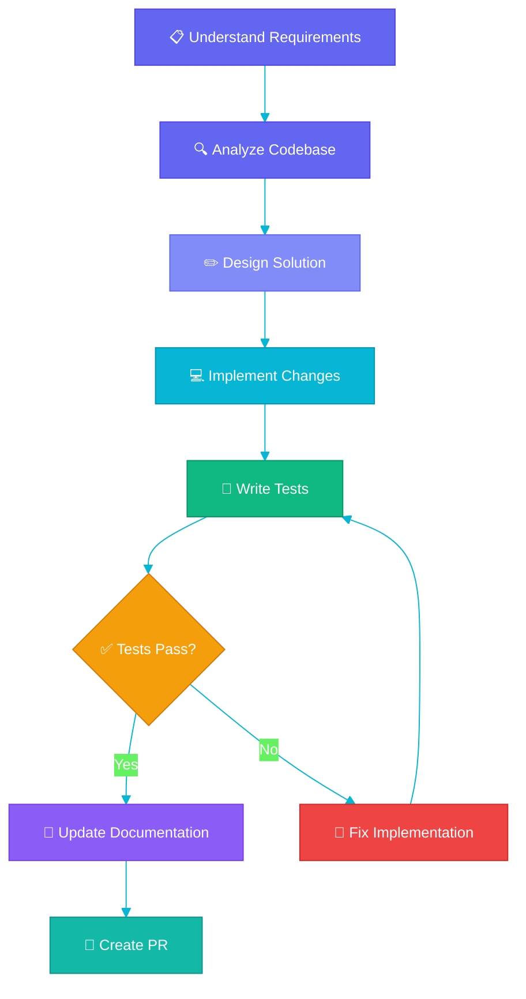

#### Workflow Configuration

```yaml
# Agent workflow definition
workflow:
  name: implement_feature
  steps:
    - id: analyze
      action: read_files
      params:
        patterns: ["src/**/*.ts", "tests/**/*.ts"]
      output: codebase_context

    - id: plan
      action: generate_plan
      input: ${analyze.output}
      output: implementation_plan

    - id: implement
      action: edit_files
      input: ${plan.output}
      validation:
        - type: build
          command: "npm run build"
        - type: lint
          command: "npm run lint"

    - id: test
      action: run_tests
      command: "npm test"
      on_failure: fix_and_retry
      max_retries: 3

    - id: document
      action: update_docs
      condition: ${test.status == 'pass'}
```

!!! note "Key Concept"
    Agent workflows should be **idempotent** where possible — running the same step twice produces the same result. This enables safe retries.

---

### 2.4 Agent Tools and Capabilities

#### Overview

Tools are the interface between agents and the external world. An agent's effectiveness depends on the quality and breadth of its available tools.

!!! quote "Official Sources"
    - [MCP Tools Specification](https://modelcontextprotocol.io/docs/concepts/tools)
    - [VS Code Agent Mode Tools](https://code.visualstudio.com/docs/copilot/chat/chat-agent-mode)

#### Built-in Copilot Agent Tools

| Tool | Category | Description |
|------|----------|-------------|
| `read_file` | Read | Read file contents from workspace |
| `write_file` | Write | Create or overwrite files |
| `edit_file` | Write | Make targeted edits to existing files |
| `list_directory` | Read | Browse project structure |
| `search_files` | Read | Find patterns across codebase |
| `run_command` | Shell | Execute terminal commands |
| `web_search` | Web | Search for documentation |
| `fetch_url` | Web | Read web page content |

#### Custom Tool Development

```typescript
// Example: Custom MCP tool for a database
import { Server } from "@modelcontextprotocol/sdk/server";

const server = new Server({
  name: "project-db",
  version: "1.0.0",
});

server.setRequestHandler("tools/list", async () => ({
  tools: [{
    name: "query_users",
    description: "Query the users table with filters",
    inputSchema: {
      type: "object",
      properties: {
        filter: { type: "string", description: "WHERE clause" },
        limit: { type: "number", default: 10 }
      }
    }
  }]
}));

server.setRequestHandler("tools/call", async (request) => {
  const { name, arguments: args } = request.params;
  if (name === "query_users") {
    const results = await db.query(
      `SELECT * FROM users WHERE ${args.filter} LIMIT ${args.limit}`
    );
    return { content: [{ type: "text", text: JSON.stringify(results) }] };
  }
});
```

#### Tool Categories and Permissions

```
┌─────────────────────────────────────────────┐
│ Read Tools: Always safe, no approval needed │
│   - read_file, search, list_directory       │
├─────────────────────────────────────────────┤
│ Write Tools: Require review/approval        │
│   - write_file, edit_file, delete_file      │
├─────────────────────────────────────────────┤
│ Shell Tools: Highest risk, explicit consent │
│   - run_command, install_package            │
├─────────────────────────────────────────────┤
│ Web Tools: Network access, data exposure    │
│   - fetch_url, api_call                     │
└─────────────────────────────────────────────┘
```

!!! tip "Exam Tip"
    Understand tool categorization by risk level. The exam tests whether you can assign appropriate permission levels to different tool types.

---

### 2.5 Building Custom Agent Extensions

#### Overview

GitHub Copilot Extensions allow developers to create domain-specific agents that extend Copilot's capabilities. Extensions are invoked via `@mentions` in Copilot Chat.

!!! quote "Official Sources"
    - [Building Copilot Extensions](https://docs.github.com/en/copilot/building-copilot-extensions)

#### Extension Architecture

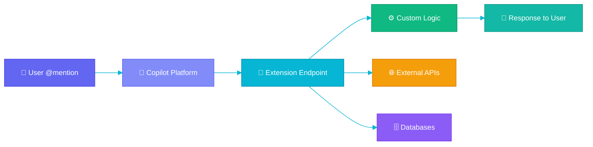

#### Creating an Extension

```typescript
// GitHub Copilot Extension handler
import { createServer } from 'http';

const server = createServer(async (req, res) => {
  if (req.method === 'POST' && req.url === '/agent') {
    const body = await getBody(req);
    const { messages, copilot_references } = JSON.parse(body);

    // Process the user's message
    const userMessage = messages[messages.length - 1].content;

    // Generate response using your custom logic
    const response = await processWithDomainKnowledge(userMessage);

    // Stream response back
    res.writeHead(200, {
      'Content-Type': 'text/event-stream',
      'Cache-Control': 'no-cache',
    });

    for await (const chunk of response) {
      res.write(`data: ${JSON.stringify(chunk)}\n\n`);
    }
    res.end();
  }
});
```

#### Extension Capabilities

- **Skill-based**: Specific actions (e.g., `@db query users`)
- **Knowledge-based**: Domain expertise (e.g., `@docs explain MCP`)
- **Workflow-based**: Multi-step processes (e.g., `@deploy staging`)

---

### 2.6 Agent Context Management

#### Overview

Context management determines what information an agent has access to when making decisions. Effective context management improves response quality and reduces hallucination.

!!! quote "Official Sources"
    - [Copilot Chat Cheat Sheet](https://docs.github.com/en/copilot/using-github-copilot/copilot-chat/github-copilot-chat-cheat-sheet)

#### Context Sources

| Source | Description | Scope |
|--------|-------------|-------|
| **Active File** | Currently open file | Always included |
| **Workspace** | All project files | Searched on demand |
| **Conversation** | Chat history | Current session |
| **References** | `#file`, `#selection` mentions | Explicitly added |
| **MCP Resources** | External data via MCP | When configured |
| **Git History** | Recent changes, blame | On demand |

#### Context Window Management

```python
# Conceptual: How context is prioritized
def build_context(request, workspace):
    context = ContextWindow(max_tokens=128000)

    # Priority 1: User's explicit request
    context.add(request.message, priority=1)

    # Priority 2: Referenced files (#file mentions)
    for ref in request.references:
        context.add(ref.content, priority=2)

    # Priority 3: Active file content
    context.add(workspace.active_file, priority=3)

    # Priority 4: Relevant files (semantic search)
    relevant = workspace.search(request.message, top_k=10)
    for file in relevant:
        context.add(file.content, priority=4)

    # Priority 5: Project structure
    context.add(workspace.file_tree, priority=5)

    return context.trim_to_fit()
```

!!! tip "Exam Tip"
    Know the hierarchy of context sources and how agents decide what's relevant. The exam tests scenarios where context management affects output quality.

---

## Domain 3: Evaluate and Optimize Agent Performance

**Weight: 10–15% of exam**

### 3.1 Measuring Agent Output Quality

#### Overview

Agent output quality encompasses correctness, completeness, relevance, and adherence to coding standards. Measuring these dimensions requires both automated metrics and human evaluation.

!!! quote "Official Sources"
    - [Azure AI Agent Evaluations](https://learn.microsoft.com/en-us/azure/ai-services/agents/concepts/evaluations)

#### Quality Metrics

| Metric | What It Measures | How to Measure |
|--------|-----------------|----------------|
| **Correctness** | Code compiles, tests pass | Automated CI checks |
| **Completeness** | All requirements addressed | Requirement coverage analysis |
| **Relevance** | Output matches the request | Human review, semantic similarity |
| **Code Quality** | Follows standards, no smells | Linters, static analysis |
| **Security** | No vulnerabilities introduced | SAST/DAST scanning |
| **Performance** | Efficient algorithms, no regressions | Benchmarks, profiling |

#### Evaluation Framework

```python
# Agent output evaluation pipeline
class AgentEvaluator:
    def evaluate(self, request, output):
        scores = {
            "correctness": self.check_builds_and_tests(output),
            "completeness": self.check_requirements_coverage(request, output),
            "quality": self.run_static_analysis(output),
            "security": self.run_security_scan(output),
        }
        return EvaluationResult(
            overall_score=sum(scores.values()) / len(scores),
            dimension_scores=scores,
            pass_threshold=0.8
        )

    def check_builds_and_tests(self, output):
        build_result = run_command("npm run build")
        test_result = run_command("npm test")
        return 1.0 if build_result.ok and test_result.ok else 0.0
```

#### Key Evaluation Approaches

1. **Ground Truth Comparison**: Compare agent output to known-correct solutions
2. **A/B Testing**: Compare agent-assisted vs. manual development metrics
3. **User Satisfaction**: Developer ratings of agent suggestions
4. **Task Success Rate**: Percentage of tasks completed without human intervention
5. **Regression Detection**: Monitoring for quality degradation over time

!!! tip "Exam Tip"
    The exam asks about both quantitative metrics (test pass rate, code coverage) and qualitative assessment (user satisfaction, code readability). Know both.

---

### 3.2 Optimizing Agent Response Latency

#### Overview

Latency directly impacts developer experience. Agents must balance thoroughness with speed to remain useful in interactive development workflows.

!!! quote "Official Sources"
    - [Azure OpenAI Latency Optimization](https://learn.microsoft.com/en-us/azure/ai-services/openai/how-to/latency)

#### Latency Optimization Strategies

| Strategy | Impact | Trade-off |
|----------|--------|-----------|
| **Streaming responses** | Perceived speed improvement | More complex implementation |
| **Caching common patterns** | 50-90% latency reduction for hits | Stale results possible |
| **Model selection** | Smaller model = faster | May reduce quality |
| **Context pruning** | Less data to process | May miss relevant info |
| **Parallel tool calls** | Faster multi-step workflows | Higher resource usage |
| **Speculative execution** | Start next step early | Wasted work if wrong |

#### Response Time Targets

```
┌──────────────────────────────────────────────┐
│ Inline suggestions: < 200ms (perceived instant) │
│ Chat responses: < 2s first token (streaming)    │
│ Agent mode steps: < 10s per action              │
│ Full agent tasks: < 5min for complex features   │
└──────────────────────────────────────────────┘
```

!!! note "Key Concept"
    Token streaming is the primary technique for reducing perceived latency. The agent starts sending output before the full response is generated.

---

### 3.3 Agent Task Completion and Monitoring

#### Overview

Monitoring agent performance in production helps identify degradation, common failure modes, and optimization opportunities.

!!! quote "Official Sources"
    - [Agent Tracing & Monitoring](https://learn.microsoft.com/en-us/azure/ai-services/agents/concepts/tracing)

#### Monitoring Dimensions

```yaml
# Agent performance monitoring configuration
monitoring:
  metrics:
    - name: task_completion_rate
      description: "Percentage of agent tasks completed without errors"
      target: "> 85%"
      alert_threshold: "< 70%"

    - name: average_iterations
      description: "Mean number of plan-execute cycles per task"
      target: "< 5"
      alert_threshold: "> 10"

    - name: tool_call_success_rate
      description: "Percentage of tool calls that succeed"
      target: "> 95%"

    - name: user_acceptance_rate
      description: "Percentage of agent outputs accepted by users"
      target: "> 75%"

    - name: time_to_completion
      description: "Average time from request to task completion"
      target: "< 3 minutes"
```

#### Performance Dashboard Metrics

| Metric | Good | Warning | Critical |
|--------|------|---------|----------|
| Task completion | > 85% | 70-85% | < 70% |
| User acceptance | > 75% | 60-75% | < 60% |
| Avg iterations | < 5 | 5-10 | > 10 |
| Error rate | < 5% | 5-15% | > 15% |
| Latency (p95) | < 5s | 5-15s | > 15s |

!!! tip "Exam Tip"
    Know the key performance indicators (KPIs) for agent systems and what constitutes acceptable vs. degraded performance. The exam uses scenarios with monitoring data.

---

## Domain 4: Secure and Govern Agentic AI Solutions

**Weight: 15–20% of exam**

### Permission Layers Overview

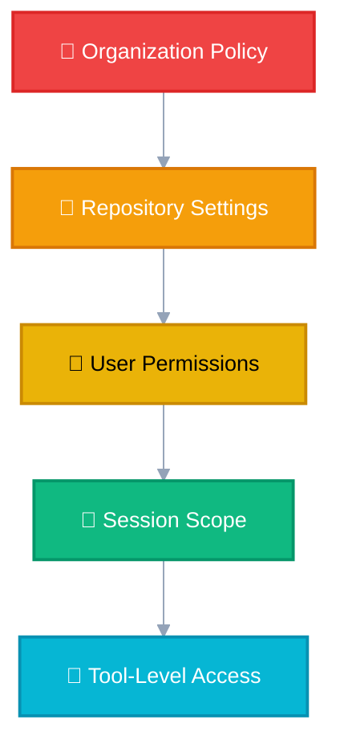

<p class="diagram-caption">🔒 Each layer narrows what the agent can access — defense in depth</p>

### 4.1 Access Controls for AI Agents

#### Overview

AI agents operate with specific permissions that must be carefully scoped. The principle of least privilege applies: agents should only have access to the resources they need to complete their task.

!!! quote "Official Sources"
    - [Copilot Policy Management](https://docs.github.com/en/copilot/managing-copilot/managing-copilot-for-your-enterprise/managing-policies-and-features-for-copilot-in-your-enterprise)

#### Permission Model

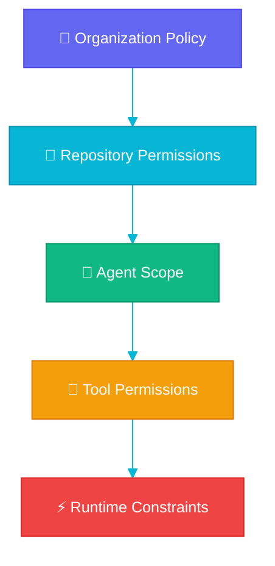

#### Access Control Levels

| Level | Controls | Example |
|-------|----------|---------|
| **Organization** | Which repos agents can access | "Copilot enabled for all repos" |
| **Repository** | What operations are allowed | "Read-only for production repos" |
| **User** | Individual permissions | "User X can use agent mode" |
| **Session** | Per-invocation scope | "This task: read src/, write tests/" |
| **Tool** | Per-tool approval | "Terminal commands require approval" |

#### Implementing Least Privilege

```json
{
  "agent_permissions": {
    "file_access": {
      "read": ["src/**", "tests/**", "docs/**"],
      "write": ["src/**", "tests/**"],
      "deny": [".env", "secrets/**", "*.key"]
    },
    "terminal": {
      "allow": ["npm test", "npm run build", "npm run lint"],
      "deny": ["rm -rf", "sudo *", "curl * | bash"]
    },
    "network": {
      "allow": ["api.github.com", "registry.npmjs.org"],
      "deny": ["*"]
    }
  }
}
```

!!! warning "Common Mistake"
    Don't grant agents blanket write access. Always scope file permissions to specific directories and exclude sensitive files like `.env`, credentials, and private keys.

---

### 4.2 Agent Permissions and Boundaries

#### Overview

Boundaries define what agents can and cannot do within a system. These boundaries must be enforced at multiple levels to prevent privilege escalation.

!!! quote "Official Sources"
    - [Agent Mode Permissions & Approval](https://docs.github.com/en/copilot/using-github-copilot/using-agent-mode-in-github-copilot)

#### Boundary Types

| Boundary | Purpose | Enforcement |
|----------|---------|-------------|
| **Scope** | Limits what files/dirs are accessible | Workspace configuration |
| **Action** | Limits what operations can be performed | Tool approval system |
| **Time** | Limits how long an agent can run | Timeout settings |
| **Resource** | Limits compute/API usage | Rate limiting, quotas |
| **Data** | Limits what data can be read/sent | DLP policies |

#### Configuration Example

```yaml
# .github/copilot-config.yml
agent:
  boundaries:
    max_file_edits_per_task: 20
    max_terminal_commands: 10
    max_execution_time_minutes: 15
    allowed_languages: [typescript, python, yaml]
    forbidden_patterns:
      - "process.env.*SECRET"
      - "password.*=.*['\"]"
      - "api_key.*=.*['\"]"
    require_approval:
      - file_deletion
      - package_installation
      - configuration_changes
```

#### Human-in-the-Loop Controls

```
Agent wants to:          User sees:              Options:
─────────────────────    ────────────────────    ──────────────────
Edit src/auth.ts    →    "Edit auth.ts?"    →    [Accept] [Reject]
Run npm install     →    "Install packages?" →   [Accept] [Reject]
Delete old tests    →    "Delete 3 files?"  →    [Accept] [Reject]
Push to main        →    BLOCKED            →    [Not allowed]
```

!!! tip "Exam Tip"
    The exam tests scenarios where you must identify which operations should require approval vs. which can be auto-approved. File reads = safe; file deletes/terminal = require approval.

---

### 4.3 Security Compliance Monitoring

#### Overview

Monitoring agent actions ensures they comply with security policies. All agent operations should be logged, auditable, and alertable.

!!! quote "Official Sources"
    - [Responsible Use of GitHub Copilot](https://docs.github.com/en/copilot/responsible-use-of-github-copilot-features)
    - [Copilot Trust Center](https://resources.github.com/copilot-trust-center/)

#### Audit Trail Requirements

```json
{
  "agent_action_log": {
    "timestamp": "2025-01-15T10:30:00Z",
    "user": "developer@org.com",
    "agent_session": "session-abc123",
    "action": "file_write",
    "target": "src/api/routes.ts",
    "tool_used": "edit_file",
    "approval_status": "auto_approved",
    "content_hash": "sha256:abc123...",
    "risk_level": "medium"
  }
}
```

#### Security Monitoring Checklist

- [ ] All agent actions logged with timestamps and user identity
- [ ] Sensitive file access triggers alerts
- [ ] Code changes scanned for secret exposure
- [ ] Network requests logged and filtered
- [ ] Rate limiting enforced per user/session
- [ ] Anomaly detection for unusual patterns
- [ ] Regular audit reviews of agent activity

---

### 4.4 Data Governance for Agent Interactions

#### Overview

Agents process code, documentation, and potentially sensitive data. Data governance ensures that information flows are controlled and compliant.

!!! quote "Official Sources"
    - [Data Handling in IDE](https://docs.github.com/en/copilot/responsible-use-of-github-copilot-features/responsible-use-of-github-copilot-in-your-ide)

#### Data Classification

| Level | Examples | Agent Access |
|-------|----------|-------------|
| **Public** | Open source code, docs | Unrestricted |
| **Internal** | Private repos, internal APIs | With authentication |
| **Confidential** | Customer data, secrets | Prohibited or encrypted |
| **Restricted** | PII, financial data | Never exposed to agents |

#### Data Governance Controls

1. **Input Filtering**: Strip sensitive data before sending to LLM
2. **Output Scanning**: Check agent output for leaked secrets
3. **Context Boundaries**: Agents only see code in allowed repositories
4. **Retention Policies**: Agent conversation data expires after X days
5. **Geographic Controls**: Data stays in specified regions

```python
# Example: Pre-processing agent context to remove secrets
def sanitize_context(file_content: str) -> str:
    patterns = [
        r'(?i)(api[_-]?key|secret|token|password)\s*[=:]\s*["\'].*?["\']',
        r'(?i)bearer\s+[a-zA-Z0-9._-]+',
        r'[a-zA-Z0-9+/]{40,}={0,2}',  # Base64-encoded secrets
    ]
    for pattern in patterns:
        file_content = re.sub(pattern, '[REDACTED]', file_content)
    return file_content
```

---

### 4.5 Managing Secrets in Agent Workflows

#### Overview

Agents must never have direct access to plaintext secrets. All credential management should use secure vaults and environment variable injection.

!!! quote "Official Sources"
    - [Using Secrets in GitHub Actions](https://docs.github.com/en/actions/security-for-github-actions/security-guides/using-secrets-in-github-actions)

#### Secure Secret Handling

```yaml
# CORRECT: Agent uses environment variables, never sees actual values
mcp_server:
  command: "node"
  args: ["./server.js"]
  env:
    DB_CONNECTION: "${secrets.DATABASE_URL}"
    API_KEY: "${secrets.EXTERNAL_API_KEY}"

# INCORRECT: Hardcoded secrets in agent-accessible config
# api_key: "sk-abc123..."  # NEVER DO THIS
```

#### Secret Management Best Practices

| Practice | Description |
|----------|-------------|
| Use vault services | GitHub Secrets, Azure Key Vault, AWS Secrets Manager |
| Rotate regularly | Automated rotation on schedule |
| Scope narrowly | Per-repo or per-environment secrets |
| Audit access | Log all secret retrievals |
| Never in code | Use .gitignore, pre-commit hooks, secret scanning |

!!! tip "Exam Tip"
    The exam asks about proper secret handling in agent workflows. Remember: agents should reference secrets by name (environment variables), never by value. GitHub's secret scanning should be enabled.

---

## Domain 5: Collaborate with AI Agents in Development

**Weight: 15–20% of exam**

### 5.1 GitHub Copilot for Code Generation and Review

#### Overview

Copilot assists at every stage of code creation: from initial generation through iteration to review. Understanding how to effectively collaborate with AI for code quality is essential.

!!! quote "Official Sources"
    - [GitHub Copilot Code Review](https://docs.github.com/en/copilot/using-github-copilot/using-github-copilot-code-review)

#### Code Generation Patterns

| Pattern | Technique | Result |
|---------|-----------|--------|
| **Prompt-driven** | Describe what you need | Full function implementation |
| **Test-first** | Write test, ask for implementation | TDD-compatible code |
| **Refactor** | Select code, describe improvement | Optimized version |
| **Pattern extension** | Show one example, ask for more | Consistent implementations |
| **Documentation-first** | Write docs, generate code | Well-documented code |

#### Effective Prompting for Code Generation

```python
# GOOD: Specific, constrained, with context
# "Create a Python function that validates email addresses
#  using regex, returns bool, handles edge cases like
#  '+' aliases and subdomains"

import re

def validate_email(email: str) -> bool:
    """Validate email address format including edge cases.

    Handles: standard emails, + aliases, subdomains, TLDs up to 63 chars.
    Rejects: double dots, leading/trailing dots, missing @.
    """
    pattern = r'^[a-zA-Z0-9._%+-]+@[a-zA-Z0-9.-]+\.[a-zA-Z]{2,63}$'
    if not email or '..' in email:
        return False
    return bool(re.match(pattern, email))

# BAD: Vague prompt → vague result
# "validate email" → might return incomplete implementation
```

#### AI-Assisted Code Review

```yaml
# GitHub Actions: Copilot-powered PR review
name: AI Code Review
on: [pull_request]

jobs:
  review:
    runs-on: ubuntu-latest
    steps:
      - uses: actions/checkout@v4
      - name: Copilot Review
        uses: github/copilot-code-review@v1
        with:
          review_scope: "security,performance,best-practices"
          severity_threshold: "medium"
          auto_comment: true
```

!!! tip "Exam Tip"
    Know the difference between code generation (creating new code) and code review (analyzing existing code). Both are tested, but different modes and approaches apply.

---

### 5.2 Agent-Assisted Debugging and Testing

#### Overview

AI agents can identify bugs, suggest fixes, generate test cases, and reproduce issues — significantly accelerating the debugging workflow.

!!! quote "Official Sources"
    - [VS Code Agent Mode for Debugging](https://code.visualstudio.com/docs/copilot/chat/chat-agent-mode)

#### Debugging Workflow with Agents

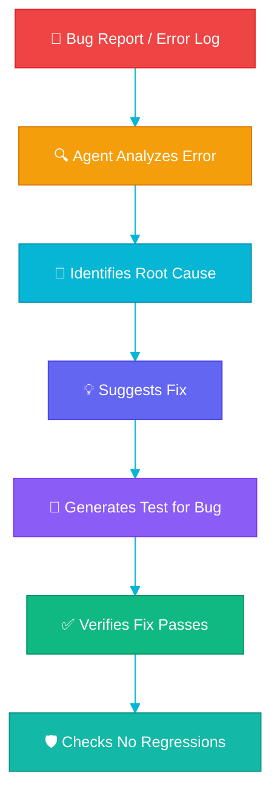

#### Test Generation Capabilities

| Type | Agent Approach | Example |
|------|---------------|---------|
| **Unit Tests** | Generate from function signature + docs | Test each branch/edge case |
| **Integration Tests** | Analyze component interactions | Test API endpoints end-to-end |
| **Edge Cases** | Identify boundary conditions | Null inputs, large values, unicode |
| **Regression Tests** | Create test reproducing a bug | Ensures bug doesn't return |
| **Property Tests** | Generate invariant-based tests | "Output always > 0" |

#### Example: Agent-Generated Test

```typescript
// Agent prompt: "Write tests for the authenticate function"
// Agent reads src/auth.ts, generates:

describe('authenticate', () => {
  it('returns user for valid credentials', async () => {
    const result = await authenticate('user@test.com', 'validPass123');
    expect(result).toHaveProperty('id');
    expect(result).toHaveProperty('token');
  });

  it('throws UnauthorizedError for invalid password', async () => {
    await expect(
      authenticate('user@test.com', 'wrongPassword')
    ).rejects.toThrow(UnauthorizedError);
  });

  it('throws NotFoundError for non-existent user', async () => {
    await expect(
      authenticate('ghost@test.com', 'anyPass')
    ).rejects.toThrow(NotFoundError);
  });

  it('rate-limits after 5 failed attempts', async () => {
    for (let i = 0; i < 5; i++) {
      await authenticate('user@test.com', 'wrong').catch(() => {});
    }
    await expect(
      authenticate('user@test.com', 'validPass123')
    ).rejects.toThrow(RateLimitError);
  });
});
```

---

### 5.3 AI Agents in CI/CD Pipelines

#### Overview

AI agents can automate CI/CD tasks: generating release notes, optimizing build configurations, auto-fixing lint errors, and managing deployments.

!!! quote "Official Sources"
    - [Copilot CLI for Pipelines](https://docs.github.com/en/copilot/using-github-copilot/using-github-copilot-in-the-command-line)
    - [GitHub Copilot Overview](https://github.com/features/copilot)

#### Agent CI/CD Integration Points

| Stage | Agent Capability | Value |
|-------|-----------------|-------|
| **Pre-commit** | Auto-fix formatting, lint issues | Cleaner commits |
| **Build** | Optimize build config, cache strategies | Faster builds |
| **Test** | Generate missing tests, fix flaky tests | Better coverage |
| **Review** | Automated PR review, security scan | Faster reviews |
| **Release** | Generate changelogs, version bumps | Consistent releases |
| **Deploy** | Configuration validation, rollback decisions | Safer deployments |

#### Example: AI-Enhanced CI/CD Pipeline

```yaml
name: AI-Enhanced CI/CD
on:
  push:
    branches: [main]
  pull_request:

jobs:
  ai-lint-fix:
    runs-on: ubuntu-latest
    steps:
      - uses: actions/checkout@v4
      - name: AI Auto-Fix Lint Issues
        uses: github/copilot-autofix@v1
        with:
          fix_types: [formatting, imports, types]
          auto_commit: true

  ai-test-coverage:
    runs-on: ubuntu-latest
    needs: ai-lint-fix
    steps:
      - uses: actions/checkout@v4
      - name: Check Coverage Gaps
        uses: github/copilot-test-gen@v1
        with:
          min_coverage: 80
          generate_for_uncovered: true

  ai-release-notes:
    runs-on: ubuntu-latest
    if: github.ref == 'refs/heads/main'
    steps:
      - uses: actions/checkout@v4
        with:
          fetch-depth: 0
      - name: Generate Release Notes
        uses: github/copilot-release-notes@v1
        with:
          format: conventional-commits
          include_breaking_changes: true
```

!!! tip "Exam Tip"
    The exam tests your understanding of WHERE in the CI/CD pipeline agents add value and WHAT operations they should/shouldn't automate. Auto-deploying to production without human approval is always wrong.

---

### 5.4 Agent-Human Interaction Patterns

#### Overview

Effective collaboration between developers and AI agents requires clear communication patterns. The way you prompt, review, and guide agents directly impacts output quality.

!!! quote "Official Sources"
    - [Copilot Chat Interaction Patterns](https://docs.github.com/en/copilot/using-github-copilot/copilot-chat/github-copilot-chat-cheat-sheet)

#### Interaction Patterns

| Pattern | Description | When to Use |
|---------|-------------|------------|
| **Direct Instruction** | "Create X with Y properties" | Well-defined tasks |
| **Iterative Refinement** | "Good, but change Z" | Complex tasks needing tuning |
| **Constraint Setting** | "Must use library X, no external deps" | Specific requirements |
| **Example-Driven** | "Like this file, but for users" | Pattern replication |
| **Exploratory** | "What approaches could solve X?" | Design decisions |

#### Best Practices for Agent Collaboration

1. **Be specific**: "Add pagination with cursor-based approach" > "Add pagination"
2. **Provide context**: Reference files, constraints, coding standards
3. **Iterate**: Accept partial results, refine with follow-ups
4. **Verify**: Always review agent output before committing
5. **Guide**: When output is wrong, explain WHY, not just "try again"

---

## Domain 6: Implement Responsible AI Practices

**Weight: 10–15% of exam**

### Responsible AI Principles Map

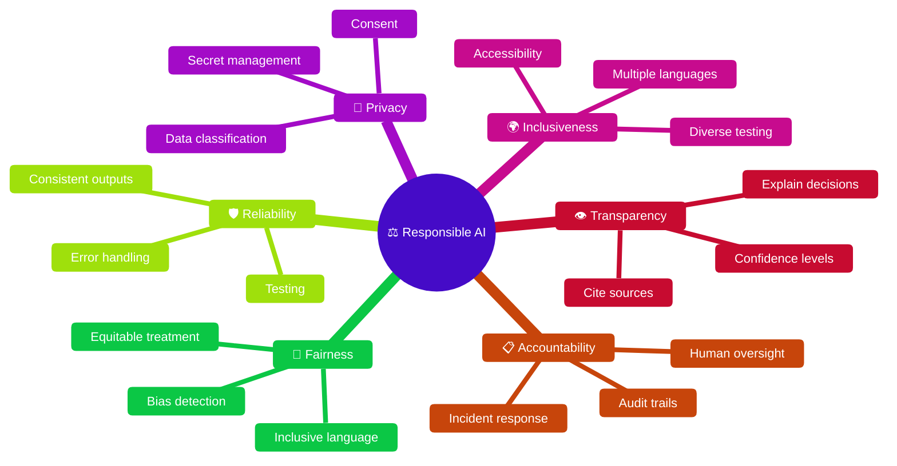

<p class="diagram-caption">⚖️ The 6 principles of Microsoft's Responsible AI framework — know each and its sub-topics</p>

### 6.1 Ethical Guidelines for Agent Behavior

#### Overview

Responsible AI ensures that AI agents act ethically, transparently, and fairly. GitHub's approach to responsible AI is guided by Microsoft's six responsible AI principles.

!!! quote "Official Sources"
    - [Microsoft AI Principles](https://www.microsoft.com/en-us/ai/principles-and-approach)
    - [Responsible Use of GitHub Copilot](https://docs.github.com/en/copilot/responsible-use-of-github-copilot-features)

#### Microsoft's Responsible AI Principles

| Principle | Description | Agent Application |
|-----------|-------------|-------------------|
| **Fairness** | Treat all users equitably | No bias in code suggestions |
| **Reliability & Safety** | Perform consistently and safely | Predictable agent behavior |
| **Privacy & Security** | Protect user data | No data leakage in suggestions |
| **Inclusiveness** | Accessible to all abilities | Support diverse coding styles |
| **Transparency** | Clear about capabilities/limits | Explain what agent can/can't do |
| **Accountability** | Humans responsible for AI systems | Human oversight required |

#### Implementing Ethical Guidelines

```yaml
# Responsible AI configuration for agent systems
responsible_ai:
  content_filtering:
    - block_harmful_code: true
    - block_biased_outputs: true
    - flag_security_risks: true

  transparency:
    - show_confidence_scores: true
    - explain_reasoning: true
    - cite_sources: true

  human_oversight:
    - require_approval_for_deployment: true
    - log_all_decisions: true
    - enable_override: true

  fairness:
    - test_for_bias: true
    - support_multiple_languages: true
    - inclusive_naming_conventions: true
```

!!! tip "Exam Tip"
    Memorize Microsoft's 6 responsible AI principles. The exam will present scenarios and ask which principle applies. FAIRNESS is about equal treatment, TRANSPARENCY is about explaining behavior.

---

### 6.2 Transparency and Explainability

#### Overview

Agents must be transparent about what they're doing and why. Users should understand agent decisions, limitations, and confidence levels.

!!! quote "Official Sources"
    - [Transparency in IDE](https://docs.github.com/en/copilot/responsible-use-of-github-copilot-features/responsible-use-of-github-copilot-in-your-ide)

#### Transparency Requirements

| Aspect | Implementation | Example |
|--------|---------------|---------|
| **Disclosure** | Clearly indicate AI-generated content | "This code was generated by Copilot" |
| **Reasoning** | Explain why a suggestion was made | "Using singleton pattern because..." |
| **Limitations** | Acknowledge uncertainty | "This may not handle edge case X" |
| **Sources** | Cite training data influence | "Based on common patterns in React" |
| **Confidence** | Signal reliability | High/Medium/Low confidence indicators |

#### Explainability in Practice

```typescript
// Agent output with transparency markers
interface AgentResponse {
  code: string;
  explanation: string;        // WHY this approach
  confidence: number;         // 0.0 - 1.0
  limitations: string[];      // Known issues
  alternatives: string[];     // Other approaches considered
  references: string[];       // Source patterns/docs
}

// Example response:
// {
//   code: "...",
//   explanation: "Using JWT for stateless auth because your app is deployed across multiple servers",
//   confidence: 0.85,
//   limitations: ["Token rotation not implemented", "Refresh tokens not included"],
//   alternatives: ["Session-based auth", "OAuth2 with PKCE"],
//   references: ["RFC 7519", "OWASP JWT Guidelines"]
// }
```

---

### 6.3 Bias and Fairness in Agent Outputs

#### Overview

AI agents can perpetuate or introduce bias through code suggestions, variable naming, documentation, and architectural decisions. Identifying and mitigating bias is a key exam topic.

!!! quote "Official Sources"
    - [Azure OpenAI Content Filtering](https://learn.microsoft.com/en-us/azure/ai-services/openai/concepts/content-filter)

#### Types of Bias in AI Agents

| Bias Type | Example | Mitigation |
|-----------|---------|-----------|
| **Training Data** | Suggesting deprecated patterns | Use up-to-date models |
| **Cultural** | English-only variable names | Support internationalization |
| **Gender** | Gendered pronouns in docs | Use inclusive language |
| **Accessibility** | Ignoring a11y in generated UI | Include ARIA attributes |
| **Language** | Preferring one programming language | Support polyglot codebases |

#### Bias Detection and Mitigation

```python
# Example: Checking agent output for bias indicators
def check_for_bias(agent_output: str) -> list[BiasIssue]:
    issues = []

    # Check for non-inclusive language
    non_inclusive = ["master", "slave", "whitelist", "blacklist"]
    for term in non_inclusive:
        if term in agent_output.lower():
            issues.append(BiasIssue(
                type="language",
                term=term,
                suggestion=INCLUSIVE_ALTERNATIVES[term]
            ))

    # Check for accessibility
    if "<img" in agent_output and 'alt="' not in agent_output:
        issues.append(BiasIssue(
            type="accessibility",
            term="image without alt text",
            suggestion="Add descriptive alt attribute"
        ))

    return issues

INCLUSIVE_ALTERNATIVES = {
    "master": "main",
    "slave": "replica",
    "whitelist": "allowlist",
    "blacklist": "denylist",
}
```

---

### 6.4 Compliance with Responsible AI Policies

#### Overview

Organizations must ensure their AI agent deployments comply with internal policies, industry regulations, and legal requirements.

!!! quote "Official Sources"
    - [Copilot Trust Center](https://resources.github.com/copilot-trust-center/)
    - [Responsible AI Overview](https://learn.microsoft.com/en-us/azure/ai-services/responsible-use-of-ai-overview)

#### Compliance Framework

| Layer | Requirement | Implementation |
|-------|-------------|----------------|
| **Legal** | Data protection (GDPR, CCPA) | Data minimization, consent |
| **Industry** | Sector-specific regulations | Healthcare, finance compliance |
| **Organizational** | Internal AI policies | Usage guidelines, training |
| **Technical** | Security standards | Encryption, access control |

#### Compliance Checklist for Agent Deployments

- [ ] Data processing agreements in place
- [ ] User consent for AI-assisted features
- [ ] Code ownership and IP rights clarified
- [ ] AI-generated content properly attributed
- [ ] Audit logs maintained for all agent actions
- [ ] Regular bias assessments conducted
- [ ] Incident response plan for AI failures
- [ ] User opt-out mechanisms available

---

### 6.5 Monitoring and Auditing Agent Decisions

#### Overview

Ongoing monitoring ensures agents continue to operate within responsible AI guidelines. Auditing provides evidence of compliance and identifies issues before they become problems.

!!! quote "Official Sources"
    - [Copilot Audit Logs](https://docs.github.com/en/copilot/managing-copilot/managing-copilot-for-your-enterprise/reviewing-audit-logs-for-copilot-business)

#### Monitoring Framework

```yaml
# Responsible AI monitoring configuration
monitoring:
  content_safety:
    scan_outputs: true
    alert_on_harmful_content: true
    retention_days: 90

  fairness_metrics:
    track_suggestion_diversity: true
    measure_language_coverage: true
    report_frequency: weekly

  compliance:
    log_all_interactions: true
    anonymize_after_days: 30
    audit_schedule: quarterly

  incident_response:
    auto_escalate_threshold: critical
    notification_channels: [email, slack]
    max_response_time_hours: 4
```

!!! tip "Exam Tip"
    The exam tests whether you know how to implement monitoring and auditing for responsible AI compliance. Key: log everything, alert on anomalies, review regularly, have an incident response plan.

---

## Cross-Domain Themes

### Theme: Security Runs Through Everything

Security isn't just Domain 4 — it appears across all domains:
- **Domain 1**: Secure architecture design
- **Domain 2**: Secure tool permissions in MCP
- **Domain 3**: Security metrics in evaluation
- **Domain 4**: Core security controls
- **Domain 5**: Security in CI/CD pipelines
- **Domain 6**: Compliance and governance

### Theme: Human Oversight is Non-Negotiable

Every domain requires appropriate human oversight:
- Agents suggest, humans approve (production changes)
- Agents generate, humans review (code quality)
- Agents monitor, humans decide (incident response)
- Agents flag, humans investigate (security alerts)

### Theme: MCP Connects Multiple Domains

MCP appears in Domains 2, 4, and 5:
- **Domain 2**: Implementing MCP servers and tools
- **Domain 4**: Securing MCP connections and data
- **Domain 5**: Using MCP in CI/CD and collaboration

